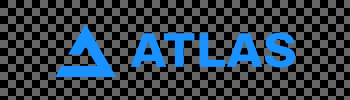
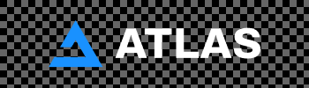
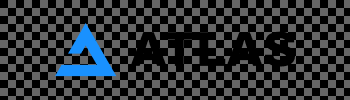
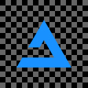
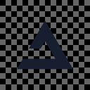
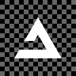
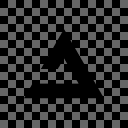

# :material-palette: Official AtlasOS Branding

We're proud to share our official branding assets with our community. Whether you're making a video, a website, or a presentation, you can use these assets to show your support for AtlasOS.

We make all of our brand assets available to the public in a variety of formats and sizes, allowing you to use them however you see fit. You can either make cool fan art or use it in your AtlasOS video reviews. The only limit is your imagination!

!!! info "Remember the brand rules"

    Please read our [Brand Guidelines](https://gcore.jsdelivr.net/gh/Atlas-OS/branding@main/atlas_brand_guidelines.pdf) for instructions on how to properly apply all of our various branding assets when applying the AtlasOS branding.

## Logomarks

=== "Ice"

    { width=250 loading=lazy }

    *Ice Logomark*

    [:material-download: Download Ice Logomark .png](https://gcore.jsdelivr.net/gh/Atlas-OS/branding@main/logomark/ice/Logomark%20-%20Ice%20Ice.png)

    [:material-download: Download Ice Logomark .svg](https://gcore.jsdelivr.net/gh/Atlas-OS/branding@main/logomark/ice/Logomark%20-%20Ice%20Ice.svg)

    [:material-download: Download Ice Logomark .pdf](https://gcore.jsdelivr.net/gh/Atlas-OS/branding@main/logomark/ice/Logomark%20-%20Ice%20Ice.pdf)

    { width=250 loading=lazy }

    *Ice + White Logomark*

    [:material-download: Download Ice + White Logomark .png](https://gcore.jsdelivr.net/gh/Atlas-OS/branding@main/logomark/ice/Logomark%20-%20Ice%20White.png)

    [:material-download: Download Ice + White Logomark .svg](https://gcore.jsdelivr.net/gh/Atlas-OS/branding@main/logomark/ice/Logomark%20-%20Ice%20White.svg)

    [:material-download: Download Ice + White Logomark .pdf](https://gcore.jsdelivr.net/gh/Atlas-OS/branding@main/logomark/ice/Logomark%20-%20Ice%20White.pdf)

    { width=250 loading=lazy }

    *Ice + Black Logomark*

    [:material-download: Download Ice + Black Logomark .png](https://gcore.jsdelivr.net/gh/Atlas-OS/branding@main/logomark/ice/Logomark%20-%20Ice%20Black.png)

    [:material-download: Download Ice + Black Logomark .svg](https://gcore.jsdelivr.net/gh/Atlas-OS/branding@main/logomark/ice/Logomark%20-%20Ice%20Black.svg)

    [:material-download: Download Ice + Black Logomark .pdf](https://gcore.jsdelivr.net/gh/Atlas-OS/branding@main/logomark/ice/Logomark%20-%20Ice%20Black.pdf)

=== "Black & White"

    { width=250 loading=lazy }

    *White Logomark*

    [:material-download: Download White Logomark .png](https://gcore.jsdelivr.net/gh/Atlas-OS/branding@main/logomark/white/Logomark%20-%20White%20White.png)

    [:material-download: Download White Logomark .svg](https://gcore.jsdelivr.net/gh/Atlas-OS/branding@main/logomark/white/Logomark%20-%20White%20White.svg)

    [:material-download: Download White Logomark .pdf](https://gcore.jsdelivr.net/gh/Atlas-OS/branding@main/logomark/white/Logomark%20-%20White%20White.pdf)

    { width=250 loading=lazy }

    *Black Logomark*

    [:material-download: Download Black Logomark .png](https://gcore.jsdelivr.net/gh/Atlas-OS/branding@main/logomark/black/Logomark%20-%20Black%20Black.png)

    [:material-download: Download Black Logomark .svg](https://gcore.jsdelivr.net/gh/Atlas-OS/branding@main/logomark/black/Logomark%20-%20Black%20Black.svg)

    [:material-download: Download Black Logomark .pdf](https://gcore.jsdelivr.net/gh/Atlas-OS/branding@main/logomark/black/Logomark%20-%20Black%20Black.pdf)

## Wordmarks

=== "Atlas Colors"

    { width=250 loading=lazy }

    *Ice Wordmark*

    [:material-download: Download Ice Wordmark .png](https://gcore.jsdelivr.net/gh/Atlas-OS/branding@main/wordmark/official/Wordmark%20-%20Ice.png)

    [:material-download: Download Ice Wordmark .svg](https://gcore.jsdelivr.net/gh/Atlas-OS/branding@main/wordmark/official/Wordmark%20-%20Ice.svg)

    [:material-download: Download Ice Wordmark .pdf](https://gcore.jsdelivr.net/gh/Atlas-OS/branding@main/wordmark/official/Wordmark%20-%20Ice.pdf)

    { width=250 loading=lazy }

    *Clouds Wordmark*

    [:material-download: Download Clouds Wordmark .png](https://gcore.jsdelivr.net/gh/Atlas-OS/branding@main/wordmark/official/Wordmark%20-%20Clouds.png)

    [:material-download: Download Clouds Wordmark .svg](https://gcore.jsdelivr.net/gh/Atlas-OS/branding@main/wordmark/official/Wordmark%20-%20Clouds.svg)

    [:material-download: Download Clouds Wordmark .pdf](https://gcore.jsdelivr.net/gh/Atlas-OS/branding@main/wordmark/official/Wordmark%20-%20Clouds.pdf)

    { width=250 loading=lazy }

    *Night Wordmark*

    [:material-download: Download Night Wordmark .png](https://gcore.jsdelivr.net/gh/Atlas-OS/branding@main/wordmark/official/Wordmark%20-%20Night.png)

    [:material-download: Download Night Wordmark .svg](https://gcore.jsdelivr.net/gh/Atlas-OS/branding@main/wordmark/official/Wordmark%20-%20Night.svg)

    [:material-download: Download Night Wordmark .pdf](https://gcore.jsdelivr.net/gh/Atlas-OS/branding@main/wordmark/official/Wordmark%20-%20Night.pdf)

=== "Black & White"

    { width=250 loading=lazy }

    *White Wordmark*

    [:material-download: Download White Wordmark .png](https://gcore.jsdelivr.net/gh/Atlas-OS/branding@main/wordmark/white/Wordmark%20-%20White.png)

    [:material-download: Download White Wordmark .svg](https://gcore.jsdelivr.net/gh/Atlas-OS/branding@main/wordmark/white/Wordmark%20-%20White.svg)

    [:material-download: Download White Wordmark .pdf](https://gcore.jsdelivr.net/gh/Atlas-OS/branding@main/wordmark/white/Wordmark%20-%20White.pdf)

    { width=250 loading=lazy }

    *Black Wordmark*

    [:material-download: Download Black Wordmark .png](https://gcore.jsdelivr.net/gh/Atlas-OS/branding@main/wordmark/black/Wordmark%20-%20Black.png)

    [:material-download: Download Black Wordmark .svg](https://gcore.jsdelivr.net/gh/Atlas-OS/branding@main/wordmark/black/Wordmark%20-%20Black.svg)

    [:material-download: Download Black Wordmark .pdf](https://gcore.jsdelivr.net/gh/Atlas-OS/branding@main/wordmark/black/Wordmark%20-%20Black.pdf)

## Icon

=== "Atlas Colors"

    { width=128 loading=lazy }

    *Ice Icon*

    [:material-download: Download Ice Icon .png](https://gcore.jsdelivr.net/gh/Atlas-OS/branding@main/icons/official/Icon%20-%20Ice.png)

    [:material-download: Download Ice Icon .svg](https://gcore.jsdelivr.net/gh/Atlas-OS/branding@main/icons/official/Icon%20-%20Ice.svg)

    [:material-download: Download Ice Icon .pdf](https://gcore.jsdelivr.net/gh/Atlas-OS/branding@main/icons/official/Icon%20-%20Ice.pdf)

    { width=128 loading=lazy }

    *Clouds Icon*

    [:material-download: Download Clouds Icon .png](https://gcore.jsdelivr.net/gh/Atlas-OS/branding@main/icons/official/Icon%20-%20Clouds.png)

    [:material-download: Download Clouds Icon .svg](https://gcore.jsdelivr.net/gh/Atlas-OS/branding@main/icons/official/Icon%20-%20Clouds.svg)

    [:material-download: Download Clouds Icon .pdf](https://gcore.jsdelivr.net/gh/Atlas-OS/branding@main/icons/official/Icon%20-%20Clouds.pdf)

    { width=128 loading=lazy }

    *Night Icon*

    [:material-download: Download Night Icon .png](https://gcore.jsdelivr.net/gh/Atlas-OS/branding@main/icons/official/Icon%20-%20Night.png)

    [:material-download: Download Night Icon .svg](https://gcore.jsdelivr.net/gh/Atlas-OS/branding@main/icons/official/Icon%20-%20Night.svg)

    [:material-download: Download Night Icon .pdf](https://gcore.jsdelivr.net/gh/Atlas-OS/branding@main/icons/official/Icon%20-%20Night.pdf)

=== "Black & White"

    { width=128 loading=lazy }

    *White Icon*

    [:material-download: Download White Icon .png](https://gcore.jsdelivr.net/gh/Atlas-OS/branding@main/icons/white/Icon%20-%20White.png)

    [:material-download: Download White Icon .svg](https://gcore.jsdelivr.net/gh/Atlas-OS/branding@main/icons/white/Icon%20-%20White.svg)

    [:material-download: Download White Icon .pdf](https://gcore.jsdelivr.net/gh/Atlas-OS/branding@main/icons/white/Icon%20-%20White.pdf)

    { width=128 loading=lazy }

    *Black Icon*

    [:material-download: Download Black Icon .png](https://gcore.jsdelivr.net/gh/Atlas-OS/branding@main/icons/black/Icon%20-%20Black.png)

    [:material-download: Download Black Icon .svg](https://gcore.jsdelivr.net/gh/Atlas-OS/branding@main/icons/black/Icon%20-%20Black.svg)

    [:material-download: Download Black Icon .pdf](https://gcore.jsdelivr.net/gh/Atlas-OS/branding@main/icons/black/Icon%20-%20Black.pdf)

## Wallpapers

### Atlas v0.3

#### Version 1

=== "v0.3 Version 1"

    { width=650 loading=lazy }

    [:material-download: Download v0.3 Version 1 Wallpaper 16:9 (3840x2160)](https://gcore.jsdelivr.net/gh/Atlas-OS/branding@main/wallpapers/16_9/v0.3/v1/Wallpapper%2016_9%20-%20v0.3.png)

    [:material-download: Download v0.3 Version 1 Wallpaper 16:10 (3440x2400)](https://gcore.jsdelivr.net/gh/Atlas-OS/branding@main/wallpapers/16_10/v0.3/v1/Wallpapper%2016_10%20-%20v0.3.png)

    [:material-download: Download v0.3 Version 1 Wallpaper 21:9 (5120x2160)](https://gcore.jsdelivr.net/gh/Atlas-OS/branding@main/wallpapers/21_9/v0.3/v1/Wallpapper%2021_9%20-%20v0.3.png)

    [:material-download: Download v0.3 Version 1 Wallpaper 4:3 (3072x2304)](https://gcore.jsdelivr.net/gh/Atlas-OS/branding@main/wallpapers/4_3/v0.3/v1/Wallpapper%204_3%20-%20v0.3.png)

=== "v0.3 Version 1.1"

    { width=650 loading=lazy }

    [:material-download: Download v0.3 Version 1.1 Wallpaper 16:9 (3840x2160)](https://gcore.jsdelivr.net/gh/Atlas-OS/branding@main/wallpapers/16_9/v0.3/v1/Wallpapper%2016_9%20-%20v0.3%20v2.png)

    [:material-download: Download v0.3 Version 1.1 Wallpaper 16:10 (3440x2400)](https://gcore.jsdelivr.net/gh/Atlas-OS/branding@main/wallpapers/16_10/v0.3/v1/Wallpapper%2016_10%20-%20v0.3%20v2.png)

    [:material-download: Download v0.3 Version 1.1 Wallpaper 21:9 (5120x2160)](https://gcore.jsdelivr.net/gh/Atlas-OS/branding@main/wallpapers/21_9/v0.3/v1/Wallpapper%2021_9%20-%20v0.3%20v2.png)

    [:material-download: Download v0.3 Version 1.1 Wallpaper 4:3 (3072x2304)](https://gcore.jsdelivr.net/gh/Atlas-OS/branding@main/wallpapers/4_3/v0.3/v1/Wallpapper%204_3%20-%20v0.3%20v2.png)

=== "v0.3 Version 1.2"

    { width=650 loading=lazy }

    [:material-download: Download v0.3 Version 1.2 Wallpaper 16:9 (3840x2160)](https://gcore.jsdelivr.net/gh/Atlas-OS/branding@main/wallpapers/16_9/v0.3/v1/Wallpapper%2016_9%20-%20v0.3%20v3.png)

    [:material-download: Download v0.3 Version 1.2 Wallpaper 16:10 (3440x2400)](https://gcore.jsdelivr.net/gh/Atlas-OS/branding@main/wallpapers/16_10/v0.3/v1/Wallpapper%2016_10%20-%20v0.3%20v3.png)

    [:material-download: Download v0.3 Version 1.2 Wallpaper 21:9 (5120x2160)](https://gcore.jsdelivr.net/gh/Atlas-OS/branding@main/wallpapers/21_9/v0.3/v1/Wallpapper%2021_9%20-%20v0.3%20v3.png)

    [:material-download: Download v0.3 Version 1.2 Wallpaper 4:3 (3072x2304)](https://gcore.jsdelivr.net/gh/Atlas-OS/branding@main/wallpapers/4_3/v0.3/v1/Wallpapper%204_3%20-%20v0.3%20v3.png)

#### Version 2

=== "v0.3 Version 2"

    { width=650 loading=lazy }

    [:material-download: Download v0.3 Version 2 Wallpaper 16:9 (3840x2160)](https://gcore.jsdelivr.net/gh/Atlas-OS/branding@main/wallpapers/16_9/v0.3/v2/Wallpapper%2016_9%20-%20v0.3%20v4.png)

    [:material-download: Download v0.3 Version 2 Wallpaper 16:10 (3440x2400)](https://gcore.jsdelivr.net/gh/Atlas-OS/branding@main/wallpapers/16_10/v0.3/v2/Wallpapper%2016_10%20-%20v0.3%20v4.png)

    [:material-download: Download v0.3 Version 2 Wallpaper 21:9 (5120x2160)](https://gcore.jsdelivr.net/gh/Atlas-OS/branding@main/wallpapers/21_9/v0.3/v2/Wallpapper%2021_9%20-%20v0.3%20v4.png)

    [:material-download: Download v0.3 Version 2 Wallpaper 4:3 (3072x2304)](https://gcore.jsdelivr.net/gh/Atlas-OS/branding@main/wallpapers/4_3/v0.3/v2/Wallpapper%2014_3%20-%20v0.3%20v4.png)

=== "v0.3 Version 2.1"

    { width=650 loading=lazy }

    [:material-download: Download v0.3 Version 2.1 Wallpaper 16:9 (3840x2160)](https://gcore.jsdelivr.net/gh/Atlas-OS/branding@main/wallpapers/16_9/v0.3/v2/Wallpapper%2016_9%20-%20v0.3%20v7.png)

    [:material-download: Download v0.3 Version 2.1 Wallpaper 16:10 (3440x2400)](https://gcore.jsdelivr.net/gh/Atlas-OS/branding@main/wallpapers/16_10/v0.3/v2/Wallpapper%2016_10%20-%20v0.3%20v7.png)

    [:material-download: Download v0.3 Version 2.1 Wallpaper 21:9 (5120x2160)](https://gcore.jsdelivr.net/gh/Atlas-OS/branding@main/wallpapers/21_9/v0.3/v2/Wallpapper%2021_9%20-%20v0.3%20v7.png)

    [:material-download: Download v0.3 Version 2.1 Wallpaper 4:3 (3072x2304)](https://gcore.jsdelivr.net/gh/Atlas-OS/branding@main/wallpapers/4_3/v0.3/v2/Wallpapper%2014_3%20-%20v0.3%20v7.png)

#### Version 3

=== "v0.3 Version 3"

    { width=650 loading=lazy }

    [:material-download: Download v0.3 Version 3 Wallpaper 16:9 (3840x2160)](https://gcore.jsdelivr.net/gh/Atlas-OS/branding@main/wallpapers/16_9/v0.3/v3/Wallpapper%2016_9%20-%20v0.3%20v5.png)

    [:material-download: Download v0.3 Version 3 Wallpaper 16:10 (3440x2400)](https://gcore.jsdelivr.net/gh/Atlas-OS/branding@main/wallpapers/16_10/v0.3/v3/Wallpapper%2016_10%20-%20v0.3%20v5.png)

    [:material-download: Download v0.3 Version 3 Wallpaper 21:9 (5120x2160)](https://gcore.jsdelivr.net/gh/Atlas-OS/branding@main/wallpapers/21_9/v0.3/v3/Wallpapper%2021_9%20-%20v0.3%20v5.png)

    [:material-download: Download v0.3 Version 3 Wallpaper 4:3 (3072x2304)](https://gcore.jsdelivr.net/gh/Atlas-OS/branding@main/wallpapers/4_3/v0.3/v3/Wallpapper%204_3%20-%20v0.3%20v5.png)

=== "v0.3 Version 3.1"

    { width=650 loading=lazy }

    [:material-download: Download v0.3 Version 3.1 Wallpaper 16:9 (3840x2160)](https://gcore.jsdelivr.net/gh/Atlas-OS/branding@main/wallpapers/16_9/v0.3/v3/Wallpapper%2016_9%20-%20v0.3%20v6.png)

    [:material-download: Download v0.3 Version 3.1 Wallpaper 16:10 (3440x2400)](https://gcore.jsdelivr.net/gh/Atlas-OS/branding@main/wallpapers/16_10/v0.3/v3/Wallpapper%2016_10%20-%20v0.3%20v6.png)

    [:material-download: Download v0.3 Version 3.1 Wallpaper 21:9 (5120x2160)](https://gcore.jsdelivr.net/gh/Atlas-OS/branding@main/wallpapers/21_9/v0.3/v3/Wallpapper%2021_9%20-%20v0.3%20v6.png)

    [:material-download: Download v0.3 Version 3.1 Wallpaper 4:3 (3072x2304)](https://gcore.jsdelivr.net/gh/Atlas-OS/branding@main/wallpapers/4_3/v0.3/v3/Wallpapper%204_3%20-%20v0.3%20v6.png)

=== "v0.3 Version 3.2"

    { width=650 loading=lazy }

    [:material-download: Download v0.3 Version 3.2 Wallpaper 16:9 (3840x2160)](https://gcore.jsdelivr.net/gh/Atlas-OS/branding@main/wallpapers/16_9/v0.3/v3/Wallpapper%2016_9%20-%20v0.3%20v8.png)

    [:material-download: Download v0.3 Version 3.2 Wallpaper 16:10 (3440x2400)](https://gcore.jsdelivr.net/gh/Atlas-OS/branding@main/wallpapers/16_10/v0.3/v3/Wallpapper%2016_10%20-%20v0.3%20v8.png)

    [:material-download: Download v0.3 Version 3.2 Wallpaper 21:9 (5120x2160)](https://gcore.jsdelivr.net/gh/Atlas-OS/branding@main/wallpapers/21_9/v0.3/v3/Wallpapper%2021_9%20-%20v0.3%20v8.png)

    [:material-download: Download v0.3 Version 3.2 Wallpaper 4:3 (3072x2304)](https://gcore.jsdelivr.net/gh/Atlas-OS/branding@main/wallpapers/4_3/v0.3/v3/Wallpapper%204_3%20-%20v0.3%20v8.png)

=== "v0.3 Version 3.3"

    { width=650 loading=lazy }

    [:material-download: Download v0.3 Version 3.3 Wallpaper 16:9 (3840x2160)](https://gcore.jsdelivr.net/gh/Atlas-OS/branding@main/wallpapers/16_9/v0.3/v3/Wallpapper%2016_9%20-%20v0.3%20v9.png)

    [:material-download: Download v0.3 Version 3.3 Wallpaper 16:10 (3440x2400)](https://gcore.jsdelivr.net/gh/Atlas-OS/branding@main/wallpapers/16_10/v0.3/v3/Wallpapper%2016_10%20-%20v0.3%20v9.png)

    [:material-download: Download v0.3 Version 3.3 Wallpaper 21:9 (5120x2160)](https://gcore.jsdelivr.net/gh/Atlas-OS/branding@main/wallpapers/21_9/v0.3/v3/Wallpapper%2021_9%20-%20v0.3%20v9.png)

    [:material-download: Download v0.3 Version 3.3 Wallpaper 4:3 (3072x2304)](https://gcore.jsdelivr.net/gh/Atlas-OS/branding@main/wallpapers/4_3/v0.3/v3/Wallpapper%204_3%20-%20v0.3%20v9.png)

#### Version 4

=== "v0.3 Version 4"

    { width=650 loading=lazy }

    [:material-download: Download v0.3 Version 4 Wallpaper 16:9 (3840x2160)](https://gcore.jsdelivr.net/gh/Atlas-OS/branding@main/wallpapers/16_9/v0.3/v4/Wallpapper%2016_9%20-%20v0.3%20v10.png)

    [:material-download: Download v0.3 Version 4 Wallpaper 16:10 (3440x2400)](https://gcore.jsdelivr.net/gh/Atlas-OS/branding@main/wallpapers/16_10/v0.3/v4/Wallpapper%2016_10%20-%20v0.3%20v10.png)

    [:material-download: Download v0.3 Version 4 Wallpaper 21:9 (5120x2160)](https://gcore.jsdelivr.net/gh/Atlas-OS/branding@main/wallpapers/21_9/v0.3/v4/Wallpapper%2021_9%20-%20v0.3%20v10.png)

    [:material-download: Download v0.3 Version 4 Wallpaper 4:3 (3072x2304)](https://gcore.jsdelivr.net/gh/Atlas-OS/branding@main/wallpapers/4_3/v0.3/v4/Wallpapper%204_3%20-%20v0.3%20v10.png)

=== "v0.3 Version 4.1"

    { width=650 loading=lazy }

    [:material-download: Download v0.3 Version 4.1 Wallpaper 16:9 (3840x2160)](https://gcore.jsdelivr.net/gh/Atlas-OS/branding@main/wallpapers/16_9/v0.3/v4/Wallpapper%2016_9%20-%20v0.3%20v11.png)

    [:material-download: Download v0.3 Version 4.1 Wallpaper 16:10 (3440x2400)](https://gcore.jsdelivr.net/gh/Atlas-OS/branding@main/wallpapers/16_10/v0.3/v4/Wallpapper%2016_10%20-%20v0.3%20v11.png)

    [:material-download: Download v0.3 Version 4.1 Wallpaper 21:9 (5120x2160)](https://gcore.jsdelivr.net/gh/Atlas-OS/branding@main/wallpapers/21_9/v0.3/v4/Wallpapper%2021_9%20-%20v0.3%20v11.png)

    [:material-download: Download v0.3 Version 4.1 Wallpaper 4:3 (3072x2304)](https://gcore.jsdelivr.net/gh/Atlas-OS/branding@main/wallpapers/4_3/v0.3/v4/Wallpapper%204_3%20-%20v0.3%20v11.png)

=== "v0.3 Version 4.2"

    { width=650 loading=lazy }

    [:material-download: Download v0.3 Version 4.2 Wallpaper 16:9 (3840x2160)](https://gcore.jsdelivr.net/gh/Atlas-OS/branding@main/wallpapers/16_9/v0.3/v4/Wallpapper%2016_9%20-%20v0.3%20v12.png)

    [:material-download: Download v0.3 Version 4.2 Wallpaper 16:10 (3440x2400)](https://gcore.jsdelivr.net/gh/Atlas-OS/branding@main/wallpapers/16_10/v0.3/v4/Wallpapper%2016_10%20-%20v0.3%20v12.png)

    [:material-download: Download v0.3 Version 4.2 Wallpaper 21:9 (5120x2160)](https://gcore.jsdelivr.net/gh/Atlas-OS/branding@main/wallpapers/21_9/v0.3/v4/Wallpapper%2021_9%20-%20v0.3%20v12.png)

    [:material-download: Download v0.3 Version 4.2 Wallpaper 4:3 (3072x2304)](https://gcore.jsdelivr.net/gh/Atlas-OS/branding@main/wallpapers/4_3/v0.3/v4/Wallpapper%204_3%20-%20v0.3%20v12.png)

=== "v0.3 Version 4.3"

    { width=650 loading=lazy }

    [:material-download: Download v0.3 Version 4.3 Wallpaper 16:9 (3840x2160)](https://gcore.jsdelivr.net/gh/Atlas-OS/branding@main/wallpapers/16_9/v0.3/v4/Wallpapper%2016_9%20-%20v0.3%20v13.png)

    [:material-download: Download v0.3 Version 4.3 Wallpaper 16:10 (3440x2400)](https://gcore.jsdelivr.net/gh/Atlas-OS/branding@main/wallpapers/16_10/v0.3/v4/Wallpapper%2016_10%20-%20v0.3%20v13.png)

    [:material-download: Download v0.3 Version 4.3 Wallpaper 21:9 (5120x2160)](https://gcore.jsdelivr.net/gh/Atlas-OS/branding@main/wallpapers/21_9/v0.3/v4/Wallpapper%2021_9%20-%20v0.3%20v13.png)

    [:material-download: Download v0.3 Version 4.3 Wallpaper 4:3 (3072x2304)](https://gcore.jsdelivr.net/gh/Atlas-OS/branding@main/wallpapers/4_3/v0.3/v4/Wallpapper%204_3%20-%20v0.3%20v13.png)

=== "v0.3 Version 4.4"

    { width=650 loading=lazy }

    [:material-download: Download v0.3 Version 4.4 Wallpaper 16:9 (3840x2160)](https://gcore.jsdelivr.net/gh/Atlas-OS/branding@main/wallpapers/16_9/v0.3/v4/Wallpapper%2016_9%20-%20v0.3%20v14.png)

    [:material-download: Download v0.3 Version 4.4 Wallpaper 16:10 (3440x2400)](https://gcore.jsdelivr.net/gh/Atlas-OS/branding@main/wallpapers/16_10/v0.3/v4/Wallpapper%2016_10%20-%20v0.3%20v14.png)

    [:material-download: Download v0.3 Version 4.4 Wallpaper 21:9 (5120x2160)](https://gcore.jsdelivr.net/gh/Atlas-OS/branding@main/wallpapers/21_9/v0.3/v4/Wallpapper%2021_9%20-%20v0.3%20v14.png)

    [:material-download: Download v0.3 Version 4.4 Wallpaper 4:3 (3072x2304)](https://gcore.jsdelivr.net/gh/Atlas-OS/branding@main/wallpapers/4_3/v0.3/v4/Wallpapper%204_3%20-%20v0.3%20v14.png)

### Generic

=== "Ice Wordmark"

    { width=650 loading=lazy }

    [:material-download: Download Ice Wordmark Wallpaper 16:9 (3840x2160)](https://gcore.jsdelivr.net/gh/Atlas-OS/branding@main/wallpapers/16_9/generic/Wallpapper%2016_9%20-%20Ice%20Wordmark.png)

    [:material-download: Download Ice Wordmark Wallpaper 16:10 (3440x2400)](https://gcore.jsdelivr.net/gh/Atlas-OS/branding@main/wallpapers/16_10/generic/Wallpapper%2016_10%20-%20Ice%20Wordmark.png)

    [:material-download: Download Ice Wordmark Wallpaper 21:9 (5120x2160)](https://gcore.jsdelivr.net/gh/Atlas-OS/branding@main/wallpapers/21_9/generic/Wallpapper%2021_9%20-%20Ice%20Wordmark.png)

    [:material-download: Download Ice Wordmark Wallpaper 4:3 (3072x2304)](https://gcore.jsdelivr.net/gh/Atlas-OS/branding@main/wallpapers/4_3/generic/Wallpapper%204_3%20-%20Ice%20Wordmark.png)

=== "Clouds Wordmark"

    { width=650 loading=lazy }

    [:material-download: Download Clouds Wordmark Wallpaper 16:9 (3840x2160)](https://gcore.jsdelivr.net/gh/Atlas-OS/branding@main/wallpapers/16_9/generic/Wallpapper%2016_9%20-%20Clouds%20Wordmark.png)

    [:material-download: Download Clouds Wordmark Wallpaper 16:10 (3440x2400)](https://gcore.jsdelivr.net/gh/Atlas-OS/branding@main/wallpapers/16_10/generic/Wallpapper%2016_10%20-%20Clouds%20Wordmark.png)

    [:material-download: Download Clouds Wordmark Wallpaper 21:9 (5120x2160)](https://gcore.jsdelivr.net/gh/Atlas-OS/branding@main/wallpapers/21_9/generic/Wallpapper%2021_9%20-%20Clouds%20Wordmark.png)

    [:material-download: Download Clouds Wordmark Wallpaper 4:3 (3072x2304)](https://gcore.jsdelivr.net/gh/Atlas-OS/branding@main/wallpapers/4_3/generic/Wallpapper%204_3%20-%20Clouds%20Wordmark.png)

=== "Night Wordmark"

    { width=650 loading=lazy }

    [:material-download: Download Night Wordmark Wallpaper 16:9 (3840x2160)](https://gcore.jsdelivr.net/gh/Atlas-OS/branding@main/wallpapers/16_9/generic/Wallpapper%2016_9%20-%20Night%20Wordmark.png)

    [:material-download: Download Night Wordmark Wallpaper 16:10 (3440x2400)](https://gcore.jsdelivr.net/gh/Atlas-OS/branding@main/wallpapers/16_10/generic/Wallpapper%2016_10%20-%20Night%20Wordmark.png)

    [:material-download: Download Night Wordmark Wallpaper 21:9 (5120x2160)](https://gcore.jsdelivr.net/gh/Atlas-OS/branding@main/wallpapers/21_+/generic/Wallpapper%2021_9%20-%20Night%20Wordmark.png)

    [:material-download: Download Night Wordmark Wallpaper 4:3 (3072x2304)](https://gcore.jsdelivr.net/gh/Atlas-OS/branding@main/wallpapers/4_3/generic/Wallpapper%204_3%20-%20Night%20Wordmark.png)

=== "Night Pride"

    { width=650 loading=lazy }

    [:material-download: Download Night Pride Wallpaper 16:9 (3840x2160)](https://gcore.jsdelivr.net/gh/Atlas-OS/branding@main/wallpapers/16_9/generic/Wallpapper%2016_9%20-%20Night%20Pride.png)

    [:material-download: Download Night Pride Wallpaper 16:10 (3440x2400)](https://gcore.jsdelivr.net/gh/Atlas-OS/branding@main/wallpapers/16_10/generic/Wallpapper%2016_10%20-%20Night%20Pride.png)

    [:material-download: Download Night Pride Wallpaper 21:9 (5120x2160)](https://gcore.jsdelivr.net/gh/Atlas-OS/branding@main/wallpapers/21_9/generic/Wallpapper%2021_9%20-%20Night%20Pride.png)

    [:material-download: Download Night Pride Wallpaper 4:3 (3072x2304)](https://gcore.jsdelivr.net/gh/Atlas-OS/branding@main/wallpapers/4_3/generic/Wallpapper%204_3%20-%20Night%20Pride.png)

=== "Setup"

    { width=650 loading=lazy }

    *Photo taken by [Roberto Nickson (@rpnickson)](https://unsplash.com/@rpnickson) via Unsplash.*

    [:material-download: Download Setup Wallpaper 16:9 (3840x2160)](https://gcore.jsdelivr.net/gh/Atlas-OS/branding@main/wallpapers/16_9/generic/Wallpapper%2016_9%20-%20Setup.png)

    [:material-download: Download Setup Wallpaper 16:10 (3440x2400)](https://gcore.jsdelivr.net/gh/Atlas-OS/branding@main/wallpapers/16_10/generic/Wallpapper%2016_10%20-%20Setup.png)

    [:material-download: Download Setup Wallpaper 21:9 (5120x2160)](https://gcore.jsdelivr.net/gh/Atlas-OS/branding@main/wallpapers/21_9/generic/Wallpapper%2021_9%20-%20Setup.png)

    [:material-download: Download Setup Wallpaper 4:3 (3072x2304)](https://gcore.jsdelivr.net/gh/Atlas-OS/branding@main/wallpapers/4_3/generic/Wallpapper%204_3%20-%20Setup.png)
