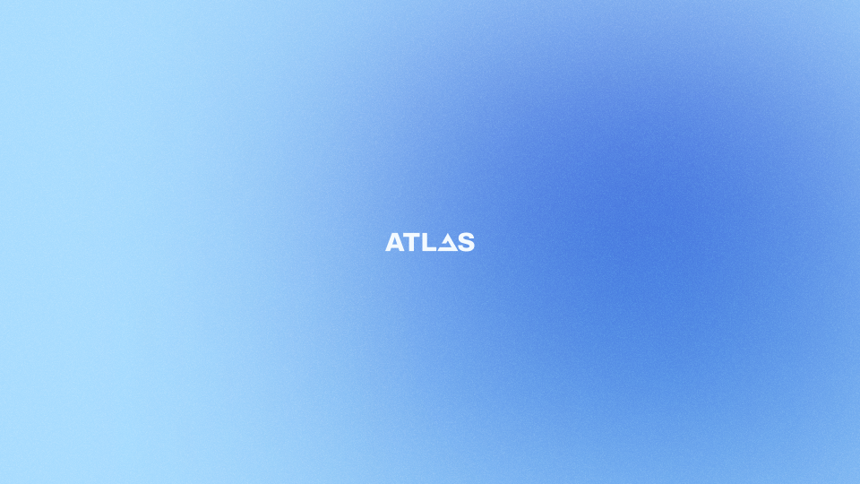
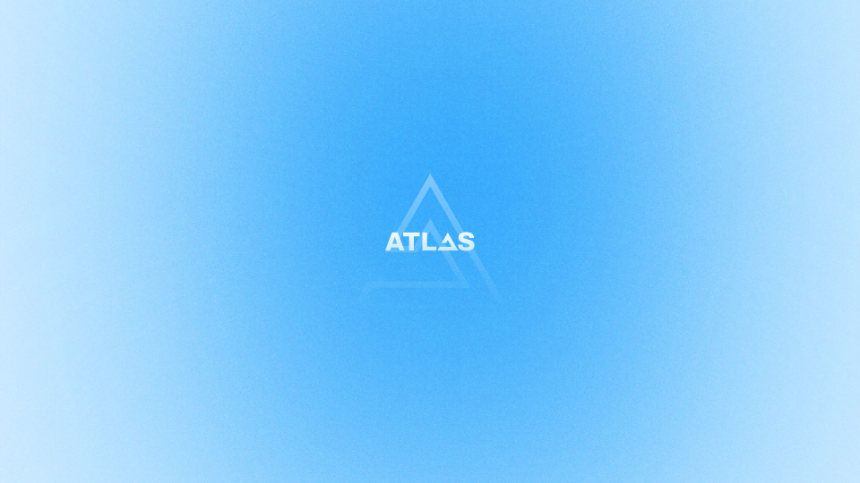
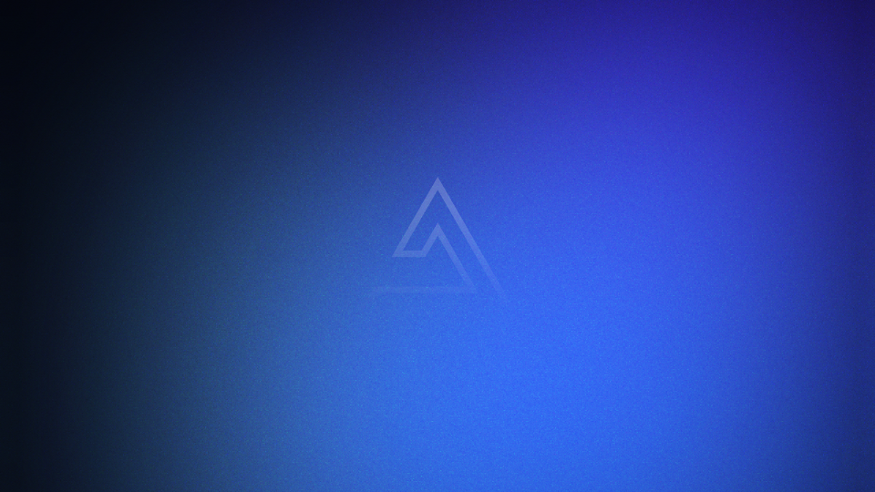
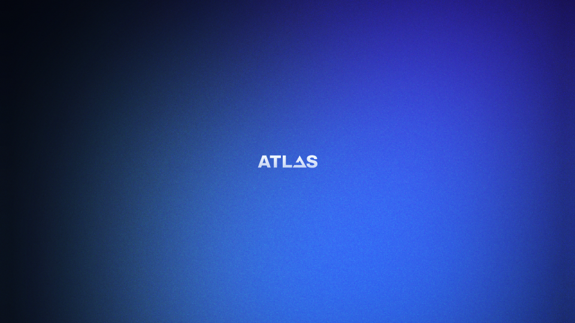

# :material-palette: Official AtlasOS Branding

We're proud to share our official branding assets with our community. Whether you're making a video, a website, or a presentation, you can use these assets to show your support for AtlasOS.

We make all of our brand assets available to the public in a variety of formats and sizes, allowing you to use them however you see fit. You can either make cool fan art or use it in your AtlasOS video reviews. The only limit is your imagination!

!!! info ""

    The utilization of our branding assets is subject to our [Brand Guidelines](https://gcore.jsdelivr.net/gh/Atlas-OS/branding@main/atlas_brand_guidelines.pdf). We kindly request that you adhere to these guidelines to ensure the appropriate application of the AtlasOS branding.

## Logomarks

-   { width=250 loading=lazy }

    __Ice Logomark__

    ---
    
    [:material-download: PNG](https://gcore.jsdelivr.net/gh/Atlas-OS/branding@main/logomark/ice/Logomark%20-%20Ice%20Ice.png)
    [:material-download: SVG](https://gcore.jsdelivr.net/gh/Atlas-OS/branding@main/logomark/ice/Logomark%20-%20Ice%20Ice.svg)
    [:material-download: PDF](https://gcore.jsdelivr.net/gh/Atlas-OS/branding@main/logomark/ice/Logomark%20-%20Ice%20Ice.pdf)
    
-   { width=250 loading=lazy }

    __Ice + White Logomark__

    ---

    [:material-download: PNG](https://gcore.jsdelivr.net/gh/Atlas-OS/branding@main/logomark/ice/Logomark%20-%20Ice%20White.png)
    [:material-download: SVG](https://gcore.jsdelivr.net/gh/Atlas-OS/branding@main/logomark/ice/Logomark%20-%20Ice%20White.svg)
    [:material-download: PDF](https://gcore.jsdelivr.net/gh/Atlas-OS/branding@main/logomark/ice/Logomark%20-%20Ice%20White.pdf)

-   { width=250 loading=lazy }

    __Ice + Black Logomark__

    ---

    [:material-download: PNG](https://gcore.jsdelivr.net/gh/Atlas-OS/branding@main/logomark/ice/Logomark%20-%20Ice%20Black.png)
    [:material-download: SVG](https://gcore.jsdelivr.net/gh/Atlas-OS/branding@main/logomark/ice/Logomark%20-%20Ice%20Black.svg)
    [:material-download: PDF](https://gcore.jsdelivr.net/gh/Atlas-OS/branding@main/logomark/ice/Logomark%20-%20Ice%20Black.pdf)

-   { width=250 loading=lazy }

    __White Logomark__

    ---

    [:material-download: PNG](https://gcore.jsdelivr.net/gh/Atlas-OS/branding@main/logomark/white/Logomark%20-%20White%20White.png)
    [:material-download: SVG](https://gcore.jsdelivr.net/gh/Atlas-OS/branding@main/logomark/white/Logomark%20-%20White%20White.svg)
    [:material-download: PDF](https://gcore.jsdelivr.net/gh/Atlas-OS/branding@main/logomark/white/Logomark%20-%20White%20White.pdf)

-   { width=250 loading=lazy }

    __Black Logomark__

    ---

    [:material-download: PNG](https://gcore.jsdelivr.net/gh/Atlas-OS/branding@main/logomark/black/Logomark%20-%20Black%20Black.png)
    [:material-download: SVG](https://gcore.jsdelivr.net/gh/Atlas-OS/branding@main/logomark/black/Logomark%20-%20Black%20Black.svg)
    [:material-download: PDF](https://gcore.jsdelivr.net/gh/Atlas-OS/branding@main/logomark/black/Logomark%20-%20Black%20Black.pdf)

## Wordmarks

-   { width=250 loading=lazy }

    __Ice Wordmark__

    ---

    [:material-download: PNG](https://gcore.jsdelivr.net/gh/Atlas-OS/branding@main/wordmark/official/Wordmark%20-%20Ice.png)
    [:material-download: SVG](https://gcore.jsdelivr.net/gh/Atlas-OS/branding@main/wordmark/official/Wordmark%20-%20Ice.svg)
    [:material-download: PDF](https://gcore.jsdelivr.net/gh/Atlas-OS/branding@main/wordmark/official/Wordmark%20-%20Ice.pdf)

-   { width=250 loading=lazy }

    __Clouds Wordmark__

    ---

    [:material-download: PNG](https://gcore.jsdelivr.net/gh/Atlas-OS/branding@main/wordmark/official/Wordmark%20-%20Clouds.png)
    [:material-download: SVG](https://gcore.jsdelivr.net/gh/Atlas-OS/branding@main/wordmark/official/Wordmark%20-%20Clouds.svg)
    [:material-download: PDF](https://gcore.jsdelivr.net/gh/Atlas-OS/branding@main/wordmark/official/Wordmark%20-%20Clouds.pdf)

-   { width=250 loading=lazy }

    __Night Wordmark__

    ---

    [:material-download: PNG](https://gcore.jsdelivr.net/gh/Atlas-OS/branding@main/wordmark/official/Wordmark%20-%20Night.png)
    [:material-download: SVG](https://gcore.jsdelivr.net/gh/Atlas-OS/branding@main/wordmark/official/Wordmark%20-%20Night.svg)
    [:material-download: PDF](https://gcore.jsdelivr.net/gh/Atlas-OS/branding@main/wordmark/official/Wordmark%20-%20Night.pdf)

-   { width=250 loading=lazy }

    __White Wordmark__

    ---

    [:material-download: PNG](https://gcore.jsdelivr.net/gh/Atlas-OS/branding@main/wordmark/white/Wordmark%20-%20White.png)
    [:material-download: SVG](https://gcore.jsdelivr.net/gh/Atlas-OS/branding@main/wordmark/white/Wordmark%20-%20White.svg)
    [:material-download: PDF](https://gcore.jsdelivr.net/gh/Atlas-OS/branding@main/wordmark/white/Wordmark%20-%20White.pdf)

-   { width=250 loading=lazy }

    __Black Wordmark__

    ---

    [:material-download: PNG](https://gcore.jsdelivr.net/gh/Atlas-OS/branding@main/wordmark/black/Wordmark%20-%20Black.png)
    [:material-download: SVG](https://gcore.jsdelivr.net/gh/Atlas-OS/branding@main/wordmark/black/Wordmark%20-%20Black.svg)
    [:material-download: PDF](https://gcore.jsdelivr.net/gh/Atlas-OS/branding@main/wordmark/black/Wordmark%20-%20Black.pdf)

## Icon

-   { width=128 loading=lazy }

    __Ice Icon__

    ---

    [:material-download: PNG](https://gcore.jsdelivr.net/gh/Atlas-OS/branding@main/icons/official/Icon%20-%20Ice.png)
    [:material-download: SVG](https://gcore.jsdelivr.net/gh/Atlas-OS/branding@main/icons/official/Icon%20-%20Ice.svg)
    [:material-download: PDF](https://gcore.jsdelivr.net/gh/Atlas-OS/branding@main/icons/official/Icon%20-%20Ice.pdf)

-   { width=128 loading=lazy }

    __Clouds Icon__

    ---

    [:material-download: PNG](https://gcore.jsdelivr.net/gh/Atlas-OS/branding@main/icons/official/Icon%20-%20Clouds.png)
    [:material-download: SVG](https://gcore.jsdelivr.net/gh/Atlas-OS/branding@main/icons/official/Icon%20-%20Clouds.svg)
    [:material-download: PDF](https://gcore.jsdelivr.net/gh/Atlas-OS/branding@main/icons/official/Icon%20-%20Clouds.pdf)

-   { width=128 loading=lazy }

    __Night Icon__

    ---

    [:material-download: PNG](https://gcore.jsdelivr.net/gh/Atlas-OS/branding@main/icons/official/Icon%20-%20Night.png)
    [:material-download: SVG](https://gcore.jsdelivr.net/gh/Atlas-OS/branding@main/icons/official/Icon%20-%20Night.svg)
    [:material-download: PDF](https://gcore.jsdelivr.net/gh/Atlas-OS/branding@main/icons/official/Icon%20-%20Night.pdf)

-   { width=128 loading=lazy }

    __White Icon__

    ---

    [:material-download: PNG](https://gcore.jsdelivr.net/gh/Atlas-OS/branding@main/icons/white/Icon%20-%20White.png)
    [:material-download: SVG](https://gcore.jsdelivr.net/gh/Atlas-OS/branding@main/icons/white/Icon%20-%20White.svg)
    [:material-download: PDF](https://gcore.jsdelivr.net/gh/Atlas-OS/branding@main/icons/white/Icon%20-%20White.pdf)

-   { width=128 loading=lazy }

    __Black Icon__

    ---

    [:material-download: PNG](https://gcore.jsdelivr.net/gh/Atlas-OS/branding@main/icons/black/Icon%20-%20Black.png)
    [:material-download: SVG](https://gcore.jsdelivr.net/gh/Atlas-OS/branding@main/icons/black/Icon%20-%20Black.svg)
    [:material-download: PDF](https://gcore.jsdelivr.net/gh/Atlas-OS/branding@main/icons/black/Icon%20-%20Black.pdf)

## Avatars

-   { width=128 loading=lazy style="border-radius:5%" }

    __Version 1__

    ---

    [:material-download: PNG (460x460)](https://gcore.jsdelivr.net/gh/Atlas-OS/branding@main/avatars/avatar-v1.png)

-   { width=128 loading=lazy style="border-radius:5%" }

    __Version 2__

    ---

    [:material-download: PNG (460x460)](https://gcore.jsdelivr.net/gh/Atlas-OS/branding@main/avatars/avatar-v1.png)

## Banners

=== "Version 1"
    

    [:material-download: PNG (1920x653)](https://gcore.jsdelivr.net/gh/Atlas-OS/branding@main/banners/banner-v1.png)

=== "Version 2"
    

    [:material-download: PNG (1920x653)](https://gcore.jsdelivr.net/gh/Atlas-OS/branding@main/banners/banner-v1.png)

=== "Version 3"
    

    [:material-download: PNG (1920x653)](ttps://gcore.jsdelivr.net/gh/Atlas-OS/branding@main/banners/banner-v3.png)

## Wallpapers

### Atlas v0.4

#### Rev 1

=== "v0.4 Rev 1"
    { width=650 loading=lazy }

    [:material-download: PNG 16:9 (3840x2160)](https://gcore.jsdelivr.net/gh/Atlas-OS/branding@main/wallpapers/16_9/v0.4/v1/16_9-v0.4-v1.png)

    [:material-download: PNG 16:10 (3440x2400)](https://gcore.jsdelivr.net/gh/Atlas-OS/branding@main/wallpapers/16_10/v0.4/v1/16_10-v0.4-v1.png)
    
    [:material-download: PNG 21:9 (5120x2160)](https://gcore.jsdelivr.net/gh/Atlas-OS/branding@main/wallpapers/21_9/v0.4/v1/21_9-v0.4-v1.png)
    
    [:material-download: PNG 4:3 (3072x2304)](https://gcore.jsdelivr.net/gh/Atlas-OS/branding@main/wallpapers/4_3/v0.4/v1/4_3-v0.4-v1.png)

=== "v0.4 Rev 1.1"
    { width=650 loading=lazy }

    [:material-download: PNG 16:9 (3840x2160)](https://gcore.jsdelivr.net/gh/Atlas-OS/branding@main/wallpapers/16_9/v0.4/v2/16_9-v0.4-v2.png)

    [:material-download: PNG 16:10 (3440x2400)](https://gcore.jsdelivr.net/gh/Atlas-OS/branding@main/wallpapers/16_10/v0.4/v2/16_10-v0.4-v2.png)

    [:material-download: PNG 21:9 (5120x2160)](https://gcore.jsdelivr.net/gh/Atlas-OS/branding@main/wallpapers/21_9/v0.4/v2/21_9-v0.4-v2.png)

    [:material-download: PNG 4:3 (3072x2304)](https://gcore.jsdelivr.net/gh/Atlas-OS/branding@main/wallpapers/4_3/v0.4/v2/4_3-v0.4-v2.png)

### Atlas v0.3

#### Rev 1

=== "v0.3 Rev 1"

    { width=650 loading=lazy }

    [:material-download: PNG 16:9 (3840x2160)](https://gcore.jsdelivr.net/gh/Atlas-OS/branding@main/wallpapers/16_9/v0.3/v1/Wallpapper%2016_9%20-%20v0.3.png)

    [:material-download: PNG 16:10 (3440x2400)](https://gcore.jsdelivr.net/gh/Atlas-OS/branding@main/wallpapers/16_10/v0.3/v1/Wallpapper%2016_10%20-%20v0.3.png)

    [:material-download: PNG 21:9 (5120x2160)](https://gcore.jsdelivr.net/gh/Atlas-OS/branding@main/wallpapers/21_9/v0.3/v1/Wallpapper%2021_9%20-%20v0.3.png)

    [:material-download: PNG 4:3 (3072x2304)](https://gcore.jsdelivr.net/gh/Atlas-OS/branding@main/wallpapers/4_3/v0.3/v1/Wallpapper%204_3%20-%20v0.3.png)

=== "v0.3 Rev 1.1"

    { width=650 loading=lazy }

    [:material-download: PNG 16:9 (3840x2160)](https://gcore.jsdelivr.net/gh/Atlas-OS/branding@main/wallpapers/16_9/v0.3/v1/Wallpapper%2016_9%20-%20v0.3%20v2.png)

    [:material-download: PNG 16:10 (3440x2400)](https://gcore.jsdelivr.net/gh/Atlas-OS/branding@main/wallpapers/16_10/v0.3/v1/Wallpapper%2016_10%20-%20v0.3%20v2.png)

    [:material-download: PNG 21:9 (5120x2160)](https://gcore.jsdelivr.net/gh/Atlas-OS/branding@main/wallpapers/21_9/v0.3/v1/Wallpapper%2021_9%20-%20v0.3%20v2.png)

    [:material-download: PNG 4:3 (3072x2304)](https://gcore.jsdelivr.net/gh/Atlas-OS/branding@main/wallpapers/4_3/v0.3/v1/Wallpapper%204_3%20-%20v0.3%20v2.png)

=== "v0.3 Rev 1.2"

    { width=650 loading=lazy }

    [:material-download: PNG 16:9 (3840x2160)](https://gcore.jsdelivr.net/gh/Atlas-OS/branding@main/wallpapers/16_9/v0.3/v1/Wallpapper%2016_9%20-%20v0.3%20v3.png)

    [:material-download: PNG 16:10 (3440x2400)](https://gcore.jsdelivr.net/gh/Atlas-OS/branding@main/wallpapers/16_10/v0.3/v1/Wallpapper%2016_10%20-%20v0.3%20v3.png)

    [:material-download: PNG 21:9 (5120x2160)](https://gcore.jsdelivr.net/gh/Atlas-OS/branding@main/wallpapers/21_9/v0.3/v1/Wallpapper%2021_9%20-%20v0.3%20v3.png)

    [:material-download: PNG 4:3 (3072x2304)](https://gcore.jsdelivr.net/gh/Atlas-OS/branding@main/wallpapers/4_3/v0.3/v1/Wallpapper%204_3%20-%20v0.3%20v3.png)

#### Rev 2

=== "v0.3 Rev 2"

    { width=650 loading=lazy }

    [:material-download: PNG 16:9 (3840x2160)](https://gcore.jsdelivr.net/gh/Atlas-OS/branding@main/wallpapers/16_9/v0.3/v2/Wallpapper%2016_9%20-%20v0.3%20v4.png)

    [:material-download: PNG 16:10 (3440x2400)](https://gcore.jsdelivr.net/gh/Atlas-OS/branding@main/wallpapers/16_10/v0.3/v2/Wallpapper%2016_10%20-%20v0.3%20v4.png)

    [:material-download: PNG 21:9 (5120x2160)](https://gcore.jsdelivr.net/gh/Atlas-OS/branding@main/wallpapers/21_9/v0.3/v2/Wallpapper%2021_9%20-%20v0.3%20v4.png)

    [:material-download: PNG 4:3 (3072x2304)](https://gcore.jsdelivr.net/gh/Atlas-OS/branding@main/wallpapers/4_3/v0.3/v2/Wallpapper%2014_3%20-%20v0.3%20v4.png)

=== "v0.3 Rev 2.1"

    { width=650 loading=lazy }

    [:material-download: PNG 16:9 (3840x2160)](https://gcore.jsdelivr.net/gh/Atlas-OS/branding@main/wallpapers/16_9/v0.3/v2/Wallpapper%2016_9%20-%20v0.3%20v7.png)

    [:material-download: PNG 16:10 (3440x2400)](https://gcore.jsdelivr.net/gh/Atlas-OS/branding@main/wallpapers/16_10/v0.3/v2/Wallpapper%2016_10%20-%20v0.3%20v7.png)

    [:material-download: PNG 21:9 (5120x2160)](https://gcore.jsdelivr.net/gh/Atlas-OS/branding@main/wallpapers/21_9/v0.3/v2/Wallpapper%2021_9%20-%20v0.3%20v7.png)

    [:material-download: PNG 4:3 (3072x2304)](https://gcore.jsdelivr.net/gh/Atlas-OS/branding@main/wallpapers/4_3/v0.3/v2/Wallpapper%2014_3%20-%20v0.3%20v7.png)

#### Rev 3

=== "v0.3 Rev 3"

    { width=650 loading=lazy }

    [:material-download: PNG 16:9 (3840x2160)](https://gcore.jsdelivr.net/gh/Atlas-OS/branding@main/wallpapers/16_9/v0.3/v3/Wallpapper%2016_9%20-%20v0.3%20v5.png)

    [:material-download: PNG 16:10 (3440x2400)](https://gcore.jsdelivr.net/gh/Atlas-OS/branding@main/wallpapers/16_10/v0.3/v3/Wallpapper%2016_10%20-%20v0.3%20v5.png)

    [:material-download: PNG 21:9 (5120x2160)](https://gcore.jsdelivr.net/gh/Atlas-OS/branding@main/wallpapers/21_9/v0.3/v3/Wallpapper%2021_9%20-%20v0.3%20v5.png)

    [:material-download: PNG 4:3 (3072x2304)](https://gcore.jsdelivr.net/gh/Atlas-OS/branding@main/wallpapers/4_3/v0.3/v3/Wallpapper%204_3%20-%20v0.3%20v5.png)

=== "v0.3 Rev 3.1"

    { width=650 loading=lazy }

    [:material-download: PNG 16:9 (3840x2160)](https://gcore.jsdelivr.net/gh/Atlas-OS/branding@main/wallpapers/16_9/v0.3/v3/Wallpapper%2016_9%20-%20v0.3%20v6.png)

    [:material-download: PNG 16:10 (3440x2400)](https://gcore.jsdelivr.net/gh/Atlas-OS/branding@main/wallpapers/16_10/v0.3/v3/Wallpapper%2016_10%20-%20v0.3%20v6.png)

    [:material-download: PNG 21:9 (5120x2160)](https://gcore.jsdelivr.net/gh/Atlas-OS/branding@main/wallpapers/21_9/v0.3/v3/Wallpapper%2021_9%20-%20v0.3%20v6.png)

    [:material-download: PNG 4:3 (3072x2304)](https://gcore.jsdelivr.net/gh/Atlas-OS/branding@main/wallpapers/4_3/v0.3/v3/Wallpapper%204_3%20-%20v0.3%20v6.png)

=== "v0.3 Rev 3.2"

    { width=650 loading=lazy }

    [:material-download: PNG 16:9 (3840x2160)](https://gcore.jsdelivr.net/gh/Atlas-OS/branding@main/wallpapers/16_9/v0.3/v3/Wallpapper%2016_9%20-%20v0.3%20v8.png)

    [:material-download: PNG 16:10 (3440x2400)](https://gcore.jsdelivr.net/gh/Atlas-OS/branding@main/wallpapers/16_10/v0.3/v3/Wallpapper%2016_10%20-%20v0.3%20v8.png)

    [:material-download: PNG 21:9 (5120x2160)](https://gcore.jsdelivr.net/gh/Atlas-OS/branding@main/wallpapers/21_9/v0.3/v3/Wallpapper%2021_9%20-%20v0.3%20v8.png)

    [:material-download: PNG 4:3 (3072x2304)](https://gcore.jsdelivr.net/gh/Atlas-OS/branding@main/wallpapers/4_3/v0.3/v3/Wallpapper%204_3%20-%20v0.3%20v8.png)

=== "v0.3 Rev 3.3"

    { width=650 loading=lazy }

    [:material-download: PNG 16:9 (3840x2160)](https://gcore.jsdelivr.net/gh/Atlas-OS/branding@main/wallpapers/16_9/v0.3/v3/Wallpapper%2016_9%20-%20v0.3%20v9.png)

    [:material-download: PNG 16:10 (3440x2400)](https://gcore.jsdelivr.net/gh/Atlas-OS/branding@main/wallpapers/16_10/v0.3/v3/Wallpapper%2016_10%20-%20v0.3%20v9.png)

    [:material-download: PNG 21:9 (5120x2160)](https://gcore.jsdelivr.net/gh/Atlas-OS/branding@main/wallpapers/21_9/v0.3/v3/Wallpapper%2021_9%20-%20v0.3%20v9.png)

    [:material-download: PNG 4:3 (3072x2304)](https://gcore.jsdelivr.net/gh/Atlas-OS/branding@main/wallpapers/4_3/v0.3/v3/Wallpapper%204_3%20-%20v0.3%20v9.png)

#### Rev 4

=== "v0.3 Rev 4"

    { width=650 loading=lazy }

    [:material-download: PNG 16:9 (3840x2160)](https://gcore.jsdelivr.net/gh/Atlas-OS/branding@main/wallpapers/16_9/v0.3/v4/Wallpapper%2016_9%20-%20v0.3%20v10.png)

    [:material-download: PNG 16:10 (3440x2400)](https://gcore.jsdelivr.net/gh/Atlas-OS/branding@main/wallpapers/16_10/v0.3/v4/Wallpapper%2016_10%20-%20v0.3%20v10.png)

    [:material-download: PNG 21:9 (5120x2160)](https://gcore.jsdelivr.net/gh/Atlas-OS/branding@main/wallpapers/21_9/v0.3/v4/Wallpapper%2021_9%20-%20v0.3%20v10.png)

    [:material-download: PNG 4:3 (3072x2304)](https://gcore.jsdelivr.net/gh/Atlas-OS/branding@main/wallpapers/4_3/v0.3/v4/Wallpapper%204_3%20-%20v0.3%20v10.png)

=== "v0.3 Rev 4.1"

    { width=650 loading=lazy }

    [:material-download: PNG 16:9 (3840x2160)](https://gcore.jsdelivr.net/gh/Atlas-OS/branding@main/wallpapers/16_9/v0.3/v4/Wallpapper%2016_9%20-%20v0.3%20v11.png)

    [:material-download: PNG 16:10 (3440x2400)](https://gcore.jsdelivr.net/gh/Atlas-OS/branding@main/wallpapers/16_10/v0.3/v4/Wallpapper%2016_10%20-%20v0.3%20v11.png)

    [:material-download: PNG 21:9 (5120x2160)](https://gcore.jsdelivr.net/gh/Atlas-OS/branding@main/wallpapers/21_9/v0.3/v4/Wallpapper%2021_9%20-%20v0.3%20v11.png)

    [:material-download: PNG 4:3 (3072x2304)](https://gcore.jsdelivr.net/gh/Atlas-OS/branding@main/wallpapers/4_3/v0.3/v4/Wallpapper%204_3%20-%20v0.3%20v11.png)

=== "v0.3 Rev 4.2"

    { width=650 loading=lazy }

    [:material-download: PNG 16:9 (3840x2160)](https://gcore.jsdelivr.net/gh/Atlas-OS/branding@main/wallpapers/16_9/v0.3/v4/Wallpapper%2016_9%20-%20v0.3%20v12.png)

    [:material-download: PNG 16:10 (3440x2400)](https://gcore.jsdelivr.net/gh/Atlas-OS/branding@main/wallpapers/16_10/v0.3/v4/Wallpapper%2016_10%20-%20v0.3%20v12.png)

    [:material-download: PNG 21:9 (5120x2160)](https://gcore.jsdelivr.net/gh/Atlas-OS/branding@main/wallpapers/21_9/v0.3/v4/Wallpapper%2021_9%20-%20v0.3%20v12.png)

    [:material-download: PNG 4:3 (3072x2304)](https://gcore.jsdelivr.net/gh/Atlas-OS/branding@main/wallpapers/4_3/v0.3/v4/Wallpapper%204_3%20-%20v0.3%20v12.png)

=== "v0.3 Rev 4.3"

    { width=650 loading=lazy }

    [:material-download: PNG 16:9 (3840x2160)](https://gcore.jsdelivr.net/gh/Atlas-OS/branding@main/wallpapers/16_9/v0.3/v4/Wallpapper%2016_9%20-%20v0.3%20v13.png)

    [:material-download: PNG 16:10 (3440x2400)](https://gcore.jsdelivr.net/gh/Atlas-OS/branding@main/wallpapers/16_10/v0.3/v4/Wallpapper%2016_10%20-%20v0.3%20v13.png)

    [:material-download: PNG 21:9 (5120x2160)](https://gcore.jsdelivr.net/gh/Atlas-OS/branding@main/wallpapers/21_9/v0.3/v4/Wallpapper%2021_9%20-%20v0.3%20v13.png)

    [:material-download: PNG 4:3 (3072x2304)](https://gcore.jsdelivr.net/gh/Atlas-OS/branding@main/wallpapers/4_3/v0.3/v4/Wallpapper%204_3%20-%20v0.3%20v13.png)

=== "v0.3 Rev 4.4"

    { width=650 loading=lazy }

    [:material-download: PNG 16:9 (3840x2160)](https://gcore.jsdelivr.net/gh/Atlas-OS/branding@main/wallpapers/16_9/v0.3/v4/Wallpapper%2016_9%20-%20v0.3%20v14.png)

    [:material-download: PNG 16:10 (3440x2400)](https://gcore.jsdelivr.net/gh/Atlas-OS/branding@main/wallpapers/16_10/v0.3/v4/Wallpapper%2016_10%20-%20v0.3%20v14.png)

    [:material-download: PNG 21:9 (5120x2160)](https://gcore.jsdelivr.net/gh/Atlas-OS/branding@main/wallpapers/21_9/v0.3/v4/Wallpapper%2021_9%20-%20v0.3%20v14.png)

    [:material-download: PNG 4:3 (3072x2304)](https://gcore.jsdelivr.net/gh/Atlas-OS/branding@main/wallpapers/4_3/v0.3/v4/Wallpapper%204_3%20-%20v0.3%20v14.png)

### Generic

=== "Ice Wordmark"

    { width=650 loading=lazy }

    [:material-download: PNG 16:9 (3840x2160)](https://gcore.jsdelivr.net/gh/Atlas-OS/branding@main/wallpapers/16_9/generic/Wallpapper%2016_9%20-%20Ice%20Wordmark.png)

    [:material-download: PNG 16:10 (3440x2400)](https://gcore.jsdelivr.net/gh/Atlas-OS/branding@main/wallpapers/16_10/generic/Wallpapper%2016_10%20-%20Ice%20Wordmark.png)

    [:material-download: PNG 21:9 (5120x2160)](https://gcore.jsdelivr.net/gh/Atlas-OS/branding@main/wallpapers/21_9/generic/Wallpapper%2021_9%20-%20Ice%20Wordmark.png)

    [:material-download: PNG 4:3 (3072x2304)](https://gcore.jsdelivr.net/gh/Atlas-OS/branding@main/wallpapers/4_3/generic/Wallpapper%204_3%20-%20Ice%20Wordmark.png)

=== "Clouds Wordmark"

    { width=650 loading=lazy }

    [:material-download: PNG 16:9 (3840x2160)](https://gcore.jsdelivr.net/gh/Atlas-OS/branding@main/wallpapers/16_9/generic/Wallpapper%2016_9%20-%20Clouds%20Wordmark.png)

    [:material-download: PNG 16:10 (3440x2400)](https://gcore.jsdelivr.net/gh/Atlas-OS/branding@main/wallpapers/16_10/generic/Wallpapper%2016_10%20-%20Clouds%20Wordmark.png)

    [:material-download: PNG 21:9 (5120x2160)](https://gcore.jsdelivr.net/gh/Atlas-OS/branding@main/wallpapers/21_9/generic/Wallpapper%2021_9%20-%20Clouds%20Wordmark.png)

    [:material-download: PNG 4:3 (3072x2304)](https://gcore.jsdelivr.net/gh/Atlas-OS/branding@main/wallpapers/4_3/generic/Wallpapper%204_3%20-%20Clouds%20Wordmark.png)

=== "Night Wordmark"

    { width=650 loading=lazy }

    [:material-download: PNG 16:9 (3840x2160)](https://gcore.jsdelivr.net/gh/Atlas-OS/branding@main/wallpapers/16_9/generic/Wallpapper%2016_9%20-%20Night%20Wordmark.png)

    [:material-download: PNG 16:10 (3440x2400)](https://gcore.jsdelivr.net/gh/Atlas-OS/branding@main/wallpapers/16_10/generic/Wallpapper%2016_10%20-%20Night%20Wordmark.png)

    [:material-download: PNG 21:9 (5120x2160)](https://gcore.jsdelivr.net/gh/Atlas-OS/branding@main/wallpapers/21_+/generic/Wallpapper%2021_9%20-%20Night%20Wordmark.png)

    [:material-download: PNG 4:3 (3072x2304)](https://gcore.jsdelivr.net/gh/Atlas-OS/branding@main/wallpapers/4_3/generic/Wallpapper%204_3%20-%20Night%20Wordmark.png)

=== "Night Pride"

    { width=650 loading=lazy }

    [:material-download: PNG 16:9 (3840x2160)](https://gcore.jsdelivr.net/gh/Atlas-OS/branding@main/wallpapers/16_9/generic/Wallpapper%2016_9%20-%20Night%20Pride.png)

    [:material-download: PNG 16:10 (3440x2400)](https://gcore.jsdelivr.net/gh/Atlas-OS/branding@main/wallpapers/16_10/generic/Wallpapper%2016_10%20-%20Night%20Pride.png)

    [:material-download: PNG 21:9 (5120x2160)](https://gcore.jsdelivr.net/gh/Atlas-OS/branding@main/wallpapers/21_9/generic/Wallpapper%2021_9%20-%20Night%20Pride.png)

    [:material-download: PNG 4:3 (3072x2304)](https://gcore.jsdelivr.net/gh/Atlas-OS/branding@main/wallpapers/4_3/generic/Wallpapper%204_3%20-%20Night%20Pride.png)

=== "Setup"

    { width=650 loading=lazy }

    __Photo taken by [Roberto Nickson (@rpnickson)](https://unsplash.com/photos/Gvm2wM3V5PA) via Unsplash.__

    [:material-download: PNG 16:9 (3840x2160)](https://gcore.jsdelivr.net/gh/Atlas-OS/branding@main/wallpapers/16_9/generic/Wallpapper%2016_9%20-%20Setup.png)

    [:material-download: PNG 16:10 (3440x2400)](https://gcore.jsdelivr.net/gh/Atlas-OS/branding@main/wallpapers/16_10/generic/Wallpapper%2016_10%20-%20Setup.png)

    [:material-download: PNG 21:9 (5120x2160)](https://gcore.jsdelivr.net/gh/Atlas-OS/branding@main/wallpapers/21_9/generic/Wallpapper%2021_9%20-%20Setup.png)

    [:material-download: PNG 4:3 (3072x2304)](https://gcore.jsdelivr.net/gh/Atlas-OS/branding@main/wallpapers/4_3/generic/Wallpapper%204_3%20-%20Setup.png)
