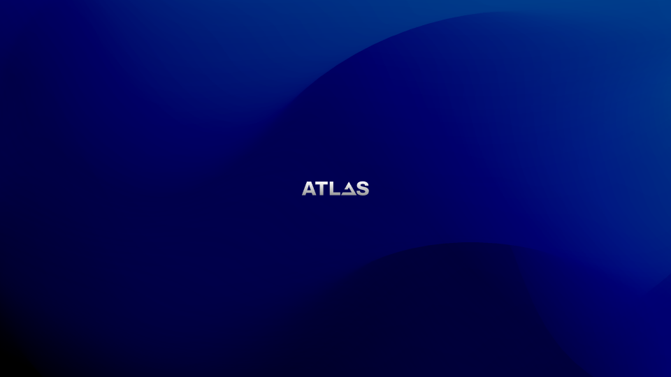

# :material-palette: Official AtlasOS Branding

We're proud to share our official branding assets with our community. Whether you're making a video, a website, or a presentation, you can use these assets to show your support for AtlasOS.

We make all our brand assets available to the public in various formats and sizes, allowing you to use them however you see fit. You can make cool fan art or use it in your AtlasOS video reviews. The only limit is your imagination!

!!! Info ""

    Copyright (C) 2025 AtlasOS <https://atlasos.net/>, All rights reserved.

    The utilization of our branding assets is subject to our [Brand Guidelines](https://gcore.jsdelivr.net/gh/Atlas-OS/branding@main/brand_guidelines_atlasos.pdf). We kindly request that you adhere to these guidelines to apply the AtlasOS branding appropriately.

## Avatars

-   { width=128 loading=lazy style="border-radius:5%" }

    __Version 1__

    ---

    [:material-download: PNG (460x460)](https://gcore.jsdelivr.net/gh/Atlas-OS/branding@main/avatars/avatar-v1.png)

-   { width=128 loading=lazy style="border-radius:5%" }

    __Version 2__

    ---

    [:material-download: PNG (460x460)](https://gcore.jsdelivr.net/gh/Atlas-OS/branding@main/avatars/avatar-v2.png)

## Banners

=== "Version 1"
    

    

    [:material-download: PNG (1920x653)](https://gcore.jsdelivr.net/gh/Atlas-OS/branding@main/banners/banner-v1.png){ .card }
    

=== "Version 2"
    

    

    [:material-download: PNG (1920x653)](https://gcore.jsdelivr.net/gh/Atlas-OS/branding@main/banners/banner-v2.png){ .card }
    

=== "Version 3"
    

    

    [:material-download: PNG (1920x653)](https://gcore.jsdelivr.net/gh/Atlas-OS/branding@main/banners/banner-v3.png){ .card }
    

## Icon

-   { width=128 loading=lazy }

    __Ice__

    ---

    [:material-download: PNG](https://gcore.jsdelivr.net/gh/Atlas-OS/branding@main/icons/icon-ice.png)
    |
    [:material-download: SVG](https://gcore.jsdelivr.net/gh/Atlas-OS/branding@main/icons/icon-ice.svg)
    |
    [:material-download: PDF](https://gcore.jsdelivr.net/gh/Atlas-OS/branding@main/icons/icon-ice.pdf)

-   { width=128 loading=lazy }

    __Clouds__

    ---
    
    [:material-download: PNG](https://gcore.jsdelivr.net/gh/Atlas-OS/branding@main/icons/icon-clouds.png)
    |
    [:material-download: SVG](https://gcore.jsdelivr.net/gh/Atlas-OS/branding@main/icons/icon-clouds.svg)
    |
    [:material-download: PDF](https://gcore.jsdelivr.net/gh/Atlas-OS/branding@main/icons/icon-clouds.pdf)

-   { width=128 loading=lazy }

    __Night__

    ---

    [:material-download: PNG](https://gcore.jsdelivr.net/gh/Atlas-OS/branding@main/icons/icon-night.png)
    |
    [:material-download: SVG](https://gcore.jsdelivr.net/gh/Atlas-OS/branding@main/icons/icon-night.svg)
    |
    [:material-download: PDF](https://gcore.jsdelivr.net/gh/Atlas-OS/branding@main/icons/icon-night.pdf)

-   { width=128 loading=lazy }

    __White__

    ---

    [:material-download: PNG](https://gcore.jsdelivr.net/gh/Atlas-OS/branding@main/icons/icon-white.png)
    |
    [:material-download: SVG](https://gcore.jsdelivr.net/gh/Atlas-OS/branding@main/icons/icon-white.svg)
    |
    [:material-download: PDF](https://gcore.jsdelivr.net/gh/Atlas-OS/branding@main/icons/icon-white.pdf)

-   { width=128 loading=lazy }

    __Black__

    ---

    [:material-download: PNG](https://gcore.jsdelivr.net/gh/Atlas-OS/branding@main/icons/icon-black.png)
    |
    [:material-download: SVG](https://gcore.jsdelivr.net/gh/Atlas-OS/branding@main/icons/icon-black.svg)
    |
    [:material-download: PDF](https://gcore.jsdelivr.net/gh/Atlas-OS/branding@main/icons/icon-black.pdf)

## Logomarks

-   { width=250 loading=lazy }

    __Ice__

    ---
    
    [:material-download: PNG](https://gcore.jsdelivr.net/gh/Atlas-OS/branding@main/logomarks/logomark-ice.png)
    |
    [:material-download: SVG](https://gcore.jsdelivr.net/gh/Atlas-OS/branding@main/logomarks/logomark-ice.svg)
    |
    [:material-download: PDF](https://gcore.jsdelivr.net/gh/Atlas-OS/branding@main/logomarks/logomark-ice.pdf)
    
-   { width=250 loading=lazy }

    __Ice + White__

    ---

    [:material-download: PNG](https://gcore.jsdelivr.net/gh/Atlas-OS/branding@main/logomarks/logomark-ice-white.png)
    |
    [:material-download: SVG](https://gcore.jsdelivr.net/gh/Atlas-OS/branding@main/logomarks/logomark-ice-white.svg)
    |
    [:material-download: PDF](https://gcore.jsdelivr.net/gh/Atlas-OS/branding@main/logomarks/logomark-ice-white.pdf)

-   { width=250 loading=lazy }

    __Ice + Black__

    ---

    [:material-download: PNG](https://gcore.jsdelivr.net/gh/Atlas-OS/branding@main/logomarks/logomark-ice-black.png)
    |
    [:material-download: SVG](https://gcore.jsdelivr.net/gh/Atlas-OS/branding@main/logomarks/logomark-ice-black.svg)
    |
    [:material-download: PDF](https://gcore.jsdelivr.net/gh/Atlas-OS/branding@main/logomarks/logomark-ice-black.pdf)

-   { width=250 loading=lazy }

    __White__

    ---

    [:material-download: PNG](https://gcore.jsdelivr.net/gh/Atlas-OS/branding@main/logomarks/logomark-white.png)
    |
    [:material-download: SVG](https://gcore.jsdelivr.net/gh/Atlas-OS/branding@main/logomarks/logomark-white.svg)
    |
    [:material-download: PDF](https://gcore.jsdelivr.net/gh/Atlas-OS/branding@main/logomarks/logomark-white.pdf)

-   { width=250 loading=lazy }

    __Black__

    ---

    [:material-download: PNG](https://gcore.jsdelivr.net/gh/Atlas-OS/branding@main/logomarks/logomark-black.png)
    |
    [:material-download: SVG](https://gcore.jsdelivr.net/gh/Atlas-OS/branding@main/logomarks/logomark-black.svg)
    |
    [:material-download: PDF](https://gcore.jsdelivr.net/gh/Atlas-OS/branding@main/logomarks/logomark-black.pdf)

## Wordmarks

-   { width=250 loading=lazy }

    __Ice__

    ---

    [:material-download: PNG](https://gcore.jsdelivr.net/gh/Atlas-OS/branding@main/wordmarks/wordmark-ice.png)
    |
    [:material-download: SVG](https://gcore.jsdelivr.net/gh/Atlas-OS/branding@main/wordmarks/wordmark-ice.svg)
    |
    [:material-download: PDF](https://gcore.jsdelivr.net/gh/Atlas-OS/branding@main/wordmarks/wordmark-ice.pdf)

-   { width=250 loading=lazy }

    __Clouds__

    ---

    [:material-download: PNG](https://gcore.jsdelivr.net/gh/Atlas-OS/branding@main/wordmarks/wordmark-clouds.png)
    |
    [:material-download: SVG](https://gcore.jsdelivr.net/gh/Atlas-OS/branding@main/wordmarks/wordmark-clouds.svg)
    |
    [:material-download: PDF](https://gcore.jsdelivr.net/gh/Atlas-OS/branding@main/wordmarks/wordmark-clouds.pdf)

-   { width=250 loading=lazy }

    __Night__

    ---

    [:material-download: PNG](https://gcore.jsdelivr.net/gh/Atlas-OS/branding@main/wordmarks/wordmark-night.png)
    |
    [:material-download: SVG](https://gcore.jsdelivr.net/gh/Atlas-OS/branding@main/wordmarks/wordmark-night.svg)
    |
    [:material-download: PDF](https://gcore.jsdelivr.net/gh/Atlas-OS/branding@main/wordmarks/wordmark-night.pdf)

-   { width=250 loading=lazy }

    __White__

    ---

    [:material-download: PNG](https://gcore.jsdelivr.net/gh/Atlas-OS/branding@main/wordmarks/wordmark-white.png)
    |
    [:material-download: SVG](https://gcore.jsdelivr.net/gh/Atlas-OS/branding@main/wordmarks/wordmark-white.svg)
    |
    [:material-download: PDF](https://gcore.jsdelivr.net/gh/Atlas-OS/branding@main/wordmarks/wordmark-white.pdf)

-   { width=250 loading=lazy }

    __Black__

    ---

    [:material-download: PNG](https://gcore.jsdelivr.net/gh/Atlas-OS/branding@main/wordmarks/wordmark-black.png)
    |
    [:material-download: SVG](https://gcore.jsdelivr.net/gh/Atlas-OS/branding@main/wordmarks/wordmark-black.svg)
    |
    [:material-download: PDF](https://gcore.jsdelivr.net/gh/Atlas-OS/branding@main/wordmarks/wordmark-black.pdf)

## Wallpapers

### Atlas v0.5

#### Rev 1

=== "v0.5 Rev 1.0 (dark)"
    { width=830 loading=lazy }

    

    [:material-download: PNG 4:3 (3072x2304)](https://gcore.jsdelivr.net/gh/Atlas-OS/branding@main/wallpapers/v0.5/rev-1/dark/wallpaper-v0.5-rev1.0-4_3.png){ .card }
    [:material-download: PNG 16:9 (3840x2160)](https://gcore.jsdelivr.net/gh/Atlas-OS/branding@main/wallpapers/v0.5/rev-1/dark/wallpaper-v0.5-rev1.0-16_9.png){ .card }
    [:material-download: PNG 16:10 (3840x2400)](https://gcore.jsdelivr.net/gh/Atlas-OS/branding@main/wallpapers/v0.5/rev-1/dark/wallpaper-v0.5-rev1.0-16_10.png){ .card }
    [:material-download: PNG 21:9 (5040x2160)](https://gcore.jsdelivr.net/gh/Atlas-OS/branding@main/wallpapers/v0.5/rev-1/dark/wallpaper-v0.5-rev1.0-21_9.png){ .card }
    

=== "v0.5 Rev 1.0 (light)"
    { width=830 loading=lazy }

    

    [:material-download: PNG 4:3 (3072x2304)](https://gcore.jsdelivr.net/gh/Atlas-OS/branding@main/wallpapers/v0.5/rev-1/light/wallpaper-v0.5-rev1.0-4_3.png){ .card }
    [:material-download: PNG 16:9 (3840x2160)](https://gcore.jsdelivr.net/gh/Atlas-OS/branding@main/wallpapers/v0.5/rev-1/light/wallpaper-v0.5-rev1.0-16_9.png){ .card }
    [:material-download: PNG 16:10 (3840x2400)](https://gcore.jsdelivr.net/gh/Atlas-OS/branding@main/wallpapers/v0.5/rev-1/light/wallpaper-v0.5-rev1.0-16_10.png){ .card }
    [:material-download: PNG 21:9 (5040x2160)](https://gcore.jsdelivr.net/gh/Atlas-OS/branding@main/wallpapers/v0.5/rev-1/light/wallpaper-v0.5-rev1.0-21_9.png){ .card }
    

### Atlas v0.4

#### Rev 1

=== "v0.4 Rev 1.0"
    { width=830 loading=lazy }

    

    [:material-download: PNG 4:3 (3072x2304)](https://gcore.jsdelivr.net/gh/Atlas-OS/branding@main/wallpapers/v0.4/rev-1/wallpaper-v0.4-rev1.0-4_3.png){ .card }
    [:material-download: PNG 16:9 (3840x2160)](https://gcore.jsdelivr.net/gh/Atlas-OS/branding@main/wallpapers/v0.4/rev-1/wallpaper-v0.4-rev1.0-16_9.png){ .card }
    [:material-download: PNG 16:10 (3840x2400)](https://gcore.jsdelivr.net/gh/Atlas-OS/branding@main/wallpapers/v0.4/rev-1/wallpaper-v0.4-rev1.0-16_10.png){ .card }
    [:material-download: PNG 21:9 (5040x2160)](https://gcore.jsdelivr.net/gh/Atlas-OS/branding@main/wallpapers/v0.4/rev-1/wallpaper-v0.4-rev1.0-21_9.png){ .card }
    

=== "v0.4 Rev 1.1"
    { width=830 loading=lazy }

    

    [:material-download: PNG 4:3 (3072x2304)](https://gcore.jsdelivr.net/gh/Atlas-OS/branding@main/wallpapers/v0.4/rev-1/wallpaper-v0.4-rev1.1-4_3.png){ .card }
    [:material-download: PNG 16:9 (3840x2160)](https://gcore.jsdelivr.net/gh/Atlas-OS/branding@main/wallpapers/v0.4/rev-1/wallpaper-v0.4-rev1.1-16_9.png){ .card }
    [:material-download: PNG 16:10 (3840x2400)](https://gcore.jsdelivr.net/gh/Atlas-OS/branding@main/wallpapers/v0.4/rev-1/wallpaper-v0.4-rev1.1-16_10.png){ .card }
    [:material-download: PNG 21:9 (5040x2160)](https://gcore.jsdelivr.net/gh/Atlas-OS/branding@main/wallpapers/v0.4/rev-1/wallpaper-v0.4-rev1.1-21_9.png){ .card }
    

### Atlas v0.3

#### Rev 1

=== "v0.3 Rev 1.0"

    { width=830 loading=lazy }

    

    [:material-download: PNG 4:3 (3072x2304)](https://gcore.jsdelivr.net/gh/Atlas-OS/branding@main/wallpapers/v0.3/rev-1/wallpaper-v0.3-rev1.0-4_3.png){ .card }
    [:material-download: PNG 16:9 (3840x2160)](https://gcore.jsdelivr.net/gh/Atlas-OS/branding@main/wallpapers/v0.3/rev-1/wallpaper-v0.3-rev1.0-16_9.png){ .card }
    [:material-download: PNG 16:10 (3840x2400)](https://gcore.jsdelivr.net/gh/Atlas-OS/branding@main/wallpapers/v0.3/rev-1/wallpaper-v0.3-rev1.0-16_10.png){ .card }
    [:material-download: PNG 21:9 (5040x2160)](https://gcore.jsdelivr.net/gh/Atlas-OS/branding@main/wallpapers/v0.3/rev-1/wallpaper-v0.3-rev1.0-21_9.png){ .card }
    

=== "v0.3 Rev 1.1"

    { width=830 loading=lazy }

    

    [:material-download: PNG 4:3 (3072x2304)](https://gcore.jsdelivr.net/gh/Atlas-OS/branding@main/wallpapers/v0.3/rev-1/wallpaper-v0.3-rev1.1-4_3.png){ .card }
    [:material-download: PNG 16:9 (3840x2160)](https://gcore.jsdelivr.net/gh/Atlas-OS/branding@main/wallpapers/v0.3/rev-1/wallpaper-v0.3-rev1.1-16_9.png){ .card }
    [:material-download: PNG 16:10 (3840x2400)](https://gcore.jsdelivr.net/gh/Atlas-OS/branding@main/wallpapers/v0.3/rev-1/wallpaper-v0.3-rev1.1-16_10.png){ .card }
    [:material-download: PNG 21:9 (5040x2160)](https://gcore.jsdelivr.net/gh/Atlas-OS/branding@main/wallpapers/v0.3/rev-1/wallpaper-v0.3-rev1.1-21_9.png){ .card }
    

=== "v0.3 Rev 1.2"

    { width=830 loading=lazy }
    

    [:material-download: PNG 4:3 (3072x2304)](https://gcore.jsdelivr.net/gh/Atlas-OS/branding@main/wallpapers/v0.3/rev-1/wallpaper-v0.3-rev1.2-4_3.png){ .card }
    [:material-download: PNG 16:9 (3840x2160)](https://gcore.jsdelivr.net/gh/Atlas-OS/branding@main/wallpapers/v0.3/rev-1/wallpaper-v0.3-rev1.2-16_9.png){ .card }
    [:material-download: PNG 16:10 (3840x2400)](https://gcore.jsdelivr.net/gh/Atlas-OS/branding@main/wallpapers/v0.3/rev-1/wallpaper-v0.3-rev1.2-16_10.png){ .card }
    [:material-download: PNG 21:9 (5040x2160)](https://gcore.jsdelivr.net/gh/Atlas-OS/branding@main/wallpapers/v0.3/rev-1/wallpaper-v0.3-rev1.2-21_9.png){ .card }
    

#### Rev 2

=== "v0.3 Rev 2.0"

    { width=830 loading=lazy }

    

    [:material-download: PNG 4:3 (3072x2304)](https://gcore.jsdelivr.net/gh/Atlas-OS/branding@main/wallpapers/v0.3/rev-2/wallpaper-v0.3-rev2.0-4_3.png){ .card }
    [:material-download: PNG 16:9 (3840x2160)](https://gcore.jsdelivr.net/gh/Atlas-OS/branding@main/wallpapers/v0.3/rev-2/wallpaper-v0.3-rev2.0-16_9.png){ .card }
    [:material-download: PNG 16:10 (3840x2400)](https://gcore.jsdelivr.net/gh/Atlas-OS/branding@main/wallpapers/v0.3/rev-2/wallpaper-v0.3-rev2.0-16_10.png){ .card }
    [:material-download: PNG 21:9 (5040x2160)](https://gcore.jsdelivr.net/gh/Atlas-OS/branding@main/wallpapers/v0.3/rev-2/wallpaper-v0.3-rev2.0-21_9.png){ .card }
    

=== "v0.3 Rev 2.1"

    { width=830 loading=lazy }

    

    [:material-download: PNG 4:3 (3072x2304)](https://gcore.jsdelivr.net/gh/Atlas-OS/branding@main/wallpapers/v0.3/rev-2/wallpaper-v0.3-rev2.1-4_3.png){ .card }
    [:material-download: PNG 16:9 (3840x2160)](https://gcore.jsdelivr.net/gh/Atlas-OS/branding@main/wallpapers/v0.3/rev-2/wallpaper-v0.3-rev2.1-16_9.png){ .card }
    [:material-download: PNG 16:10 (3840x2400)](https://gcore.jsdelivr.net/gh/Atlas-OS/branding@main/wallpapers/v0.3/rev-2/wallpaper-v0.3-rev2.1-16_10.png){ .card }
    [:material-download: PNG 21:9 (5040x2160)](https://gcore.jsdelivr.net/gh/Atlas-OS/branding@main/wallpapers/v0.3/rev-2/wallpaper-v0.3-rev2.1-21_9.png){ .card }
    

#### Rev 3

=== "v0.3 Rev 3.0"

    { width=830 loading=lazy }

    

    [:material-download: PNG 4:3 (3072x2304)](https://gcore.jsdelivr.net/gh/Atlas-OS/branding@main/wallpapers/v0.3/rev-3/wallpaper-v0.3-rev3.0-4_3.png){ .card }
    [:material-download: PNG 16:9 (3840x2160)](https://gcore.jsdelivr.net/gh/Atlas-OS/branding@main/wallpapers/v0.3/rev-3/wallpaper-v0.3-rev3.0-16_9.png){ .card }
    [:material-download: PNG 16:10 (3840x2400)](https://gcore.jsdelivr.net/gh/Atlas-OS/branding@main/wallpapers/v0.3/rev-3/wallpaper-v0.3-rev3.0-16_10.png){ .card }
    [:material-download: PNG 21:9 (5040x2160)](https://gcore.jsdelivr.net/gh/Atlas-OS/branding@main/wallpapers/v0.3/rev-3/wallpaper-v0.3-rev3.0-21_9.png){ .card }
    

=== "v0.3 Rev 3.1"

    { width=830 loading=lazy }

    

    [:material-download: PNG 4:3 (3072x2304)](https://gcore.jsdelivr.net/gh/Atlas-OS/branding@main/wallpapers/v0.3/rev-3/wallpaper-v0.3-rev3.1-4_3.png){ .card }
    [:material-download: PNG 16:9 (3840x2160)](https://gcore.jsdelivr.net/gh/Atlas-OS/branding@main/wallpapers/v0.3/rev-3/wallpaper-v0.3-rev3.1-16_9.png){ .card }
    [:material-download: PNG 16:10 (3840x2400)](https://gcore.jsdelivr.net/gh/Atlas-OS/branding@main/wallpapers/v0.3/rev-3/wallpaper-v0.3-rev3.1-16_10.png){ .card }
    [:material-download: PNG 21:9 (5040x2160)](https://gcore.jsdelivr.net/gh/Atlas-OS/branding@main/wallpapers/v0.3/rev-3/wallpaper-v0.3-rev3.1-21_9.png){ .card }
    

=== "v0.3 Rev 3.2"

    { width=830 loading=lazy }

    

    [:material-download: PNG 4:3 (3072x2304)](https://gcore.jsdelivr.net/gh/Atlas-OS/branding@main/wallpapers/v0.3/rev-3/wallpaper-v0.3-rev3.2-4_3.png){ .card }
    [:material-download: PNG 16:9 (3840x2160)](https://gcore.jsdelivr.net/gh/Atlas-OS/branding@main/wallpapers/v0.3/rev-3/wallpaper-v0.3-rev3.2-16_9.png){ .card }
    [:material-download: PNG 16:10 (3840x2400)](https://gcore.jsdelivr.net/gh/Atlas-OS/branding@main/wallpapers/v0.3/rev-3/wallpaper-v0.3-rev3.2-16_10.png){ .card }
    [:material-download: PNG 21:9 (5040x2160)](https://gcore.jsdelivr.net/gh/Atlas-OS/branding@main/wallpapers/v0.3/rev-3/wallpaper-v0.3-rev3.2-21_9.png){ .card }
    

=== "v0.3 Rev 3.3"

    { width=830 loading=lazy }

    

    [:material-download: PNG 4:3 (3072x2304)](https://gcore.jsdelivr.net/gh/Atlas-OS/branding@main/wallpapers/v0.3/rev-3/wallpaper-v0.3-rev3.3-4_3.png){ .card }
    [:material-download: PNG 16:9 (3840x2160)](https://gcore.jsdelivr.net/gh/Atlas-OS/branding@main/wallpapers/v0.3/rev-3/wallpaper-v0.3-rev3.3-16_9.png){ .card }
    [:material-download: PNG 16:10 (3840x2400)](https://gcore.jsdelivr.net/gh/Atlas-OS/branding@main/wallpapers/v0.3/rev-3/wallpaper-v0.3-rev3.3-16_10.png){ .card }
    [:material-download: PNG 21:9 (5040x2160)](https://gcore.jsdelivr.net/gh/Atlas-OS/branding@main/wallpapers/v0.3/rev-3/wallpaper-v0.3-rev3.3-21_9.png){ .card }
    

#### Rev 4

=== "v0.3 Rev 4.0"

    { width=830 loading=lazy }

    

    [:material-download: PNG 4:3 (3072x2304)](https://gcore.jsdelivr.net/gh/Atlas-OS/branding@main/wallpapers/v0.3/rev-4/wallpaper-v0.3-rev4.0-4_3.png){ .card }
    [:material-download: PNG 16:9 (3840x2160)](https://gcore.jsdelivr.net/gh/Atlas-OS/branding@main/wallpapers/v0.3/rev-4/wallpaper-v0.3-rev4.0-16_9.png){ .card }
    [:material-download: PNG 16:10 (3840x2400)](https://gcore.jsdelivr.net/gh/Atlas-OS/branding@main/wallpapers/v0.3/rev-4/wallpaper-v0.3-rev4.0-16_10.png){ .card }
    [:material-download: PNG 21:9 (5040x2160)](https://gcore.jsdelivr.net/gh/Atlas-OS/branding@main/wallpapers/v0.3/rev-4/wallpaper-v0.3-rev4.0-21_9.png){ .card }
    

=== "v0.3 Rev 4.1"

    { width=830 loading=lazy }

    

    [:material-download: PNG 4:3 (3072x2304)](https://gcore.jsdelivr.net/gh/Atlas-OS/branding@main/wallpapers/v0.3/rev-4/wallpaper-v0.3-rev4.1-4_3.png){ .card }
    [:material-download: PNG 16:9 (3840x2160)](https://gcore.jsdelivr.net/gh/Atlas-OS/branding@main/wallpapers/v0.3/rev-4/wallpaper-v0.3-rev4.1-16_9.png){ .card }
    [:material-download: PNG 16:10 (3840x2400)](https://gcore.jsdelivr.net/gh/Atlas-OS/branding@main/wallpapers/v0.3/rev-4/wallpaper-v0.3-rev4.1-16_10.png){ .card }
    [:material-download: PNG 21:9 (5040x2160)](https://gcore.jsdelivr.net/gh/Atlas-OS/branding@main/wallpapers/v0.3/rev-4/wallpaper-v0.3-rev4.1-21_9.png){ .card }
    

=== "v0.3 Rev 4.2"

    { width=830 loading=lazy }

    

    [:material-download: PNG 4:3 (3072x2304)](https://gcore.jsdelivr.net/gh/Atlas-OS/branding@main/wallpapers/v0.3/rev-4/wallpaper-v0.3-rev4.2-4_3.png){ .card }
    [:material-download: PNG 16:9 (3840x2160)](https://gcore.jsdelivr.net/gh/Atlas-OS/branding@main/wallpapers/v0.3/rev-4/wallpaper-v0.3-rev4.2-16_9.png){ .card }
    [:material-download: PNG 16:10 (3840x2400)](https://gcore.jsdelivr.net/gh/Atlas-OS/branding@main/wallpapers/v0.3/rev-4/wallpaper-v0.3-rev4.2-16_10.png){ .card }
    [:material-download: PNG 21:9 (5040x2160)](https://gcore.jsdelivr.net/gh/Atlas-OS/branding@main/wallpapers/v0.3/rev-4/wallpaper-v0.3-rev4.2-21_9.png){ .card }
    

=== "v0.3 Rev 4.3"

    { width=830 loading=lazy }

    

    [:material-download: PNG 4:3 (3072x2304)](https://gcore.jsdelivr.net/gh/Atlas-OS/branding@main/wallpapers/v0.3/rev-4/wallpaper-v0.3-rev4.3-4_3.png){ .card }
    [:material-download: PNG 16:9 (3840x2160)](https://gcore.jsdelivr.net/gh/Atlas-OS/branding@main/wallpapers/v0.3/rev-4/wallpaper-v0.3-rev4.3-16_9.png){ .card }
    [:material-download: PNG 16:10 (3840x2400)](https://gcore.jsdelivr.net/gh/Atlas-OS/branding@main/wallpapers/v0.3/rev-4/wallpaper-v0.3-rev4.3-16_10.png){ .card }
    [:material-download: PNG 21:9 (5040x2160)](https://gcore.jsdelivr.net/gh/Atlas-OS/branding@main/wallpapers/v0.3/rev-4/wallpaper-v0.3-rev4.3-21_9.png){ .card }
    

=== "v0.3 Rev 4.4"

    { width=830 loading=lazy }

    

    [:material-download: PNG 4:3 (3072x2304)](https://gcore.jsdelivr.net/gh/Atlas-OS/branding@main/wallpapers/v0.3/rev-4/wallpaper-v0.3-rev4.4-4_3.png){ .card }
    [:material-download: PNG 16:9 (3840x2160)](https://gcore.jsdelivr.net/gh/Atlas-OS/branding@main/wallpapers/v0.3/rev-4/wallpaper-v0.3-rev4.4-16_9.png){ .card }
    [:material-download: PNG 16:10 (3840x2400)](https://gcore.jsdelivr.net/gh/Atlas-OS/branding@main/wallpapers/v0.3/rev-4/wallpaper-v0.3-rev4.4-16_10.png){ .card }
    [:material-download: PNG 21:9 (5040x2160)](https://gcore.jsdelivr.net/gh/Atlas-OS/branding@main/wallpapers/v0.3/rev-4/wallpaper-v0.3-rev4.4-21_9.png){ .card }
    

### Atlas Generic

#### Rev 1

=== "Generic Rev 1.0"

    { width=830 loading=lazy }

    Originally the **Generic Clouds Wordmark-Ice Wallpaper**

    

    [:material-download: PNG 4:3 (3072x2304)](https://gcore.jsdelivr.net/gh/Atlas-OS/branding@main/wallpapers/generic/rev-1/wallpaper-generic-rev1.0-4_3.png){ .card }
    [:material-download: PNG 16:9 (3840x2160)](https://gcore.jsdelivr.net/gh/Atlas-OS/branding@main/wallpapers/generic/rev-1/wallpaper-generic-rev1.0-16_9.png){ .card }
    [:material-download: PNG 16:10 (3840x2400)](https://gcore.jsdelivr.net/gh/Atlas-OS/branding@main/wallpapers/generic/rev-1/wallpaper-generic-rev1.0-16_10.png){ .card }
    [:material-download: PNG 21:9 (5040x2160)](https://gcore.jsdelivr.net/gh/Atlas-OS/branding@main/wallpapers/generic/rev-1/wallpaper-generic-rev1.0-21_9.png){ .card }
    

=== "Generic Rev 1.1"

    { width=830 loading=lazy }

    Originally the **Generic Ice Wordmark-Clouds Wallpaper**

    

    [:material-download: PNG 4:3 (3072x2304)](https://gcore.jsdelivr.net/gh/Atlas-OS/branding@main/wallpapers/generic/rev-1/wallpaper-generic-rev1.1-4_3.png){ .card }
    [:material-download: PNG 16:9 (3840x2160)](https://gcore.jsdelivr.net/gh/Atlas-OS/branding@main/wallpapers/generic/rev-1/wallpaper-generic-rev1.1-16_9.png){ .card }
    [:material-download: PNG 16:10 (3840x2400)](https://gcore.jsdelivr.net/gh/Atlas-OS/branding@main/wallpapers/generic/rev-1/wallpaper-generic-rev1.1-16_10.png){ .card }
    [:material-download: PNG 21:9 (5040x2160)](https://gcore.jsdelivr.net/gh/Atlas-OS/branding@main/wallpapers/generic/rev-1/wallpaper-generic-rev1.1-21_9.png){ .card }
    

=== "Generic Rev 1.2"

    { width=830 loading=lazy }

    Originally the **Generic Night Wordmark-Clouds Wallpaper**

    

    [:material-download: PNG 4:3 (3072x2304)](https://gcore.jsdelivr.net/gh/Atlas-OS/branding@main/wallpapers/generic/rev-1/wallpaper-generic-rev1.2-4_3.png){ .card }
    [:material-download: PNG 16:9 (3840x2160)](https://gcore.jsdelivr.net/gh/Atlas-OS/branding@main/wallpapers/generic/rev-1/wallpaper-generic-rev1.2-16_9.png){ .card }
    [:material-download: PNG 16:10 (3840x2400)](https://gcore.jsdelivr.net/gh/Atlas-OS/branding@main/wallpapers/generic/rev-1/wallpaper-generic-rev1.2-16_10.png){ .card }
    [:material-download: PNG 21:9 (5040x2160)](https://gcore.jsdelivr.net/gh/Atlas-OS/branding@main/wallpapers/generic/rev-1/wallpaper-generic-rev1.2-21_9.png){ .card }
    

#### Rev 2

=== "Generic Rev 2.0"

    { width=830 loading=lazy }

    Originally the **Generic Setup Wallpaper**

    __Photo taken by [Roberto Nickson (@rpnickson)](https://unsplash.com/photos/Gvm2wM3V5PA) via Unsplash.__

    

    [:material-download: PNG 4:3 (3072x2304)](https://gcore.jsdelivr.net/gh/Atlas-OS/branding@main/wallpapers/generic/rev-2/wallpaper-generic-rev2.0-4_3.png){ .card }
    [:material-download: PNG 16:9 (3840x2160)](https://gcore.jsdelivr.net/gh/Atlas-OS/branding@main/wallpapers/generic/rev-2/wallpaper-generic-rev2.0-16_9.png){ .card }
    [:material-download: PNG 16:10 (3840x2400)](https://gcore.jsdelivr.net/gh/Atlas-OS/branding@main/wallpapers/generic/rev-2/wallpaper-generic-rev2.0-16_10.png){ .card }
    [:material-download: PNG 21:9 (5040x2160)](https://gcore.jsdelivr.net/gh/Atlas-OS/branding@main/wallpapers/generic/rev-2/wallpaper-generic-rev2.0-21_9.png){ .card }
    

#### Rev 3

=== "Generic Rev 3.0"

    { width=830 loading=lazy }

    Originally the **Generic Night Wordmark-Pride Wallpaper**

    

    [:material-download: PNG 4:3 (3072x2304)](https://gcore.jsdelivr.net/gh/Atlas-OS/branding@main/wallpapers/generic/rev-3/wallpaper-generic-rev3.0-4_3.png){ .card }
    [:material-download: PNG 16:9 (3840x2160)](https://gcore.jsdelivr.net/gh/Atlas-OS/branding@main/wallpapers/generic/rev-3/wallpaper-generic-rev3.0-16_9.png){ .card }
    [:material-download: PNG 16:10 (3840x2400)](https://gcore.jsdelivr.net/gh/Atlas-OS/branding@main/wallpapers/generic/rev-3/wallpaper-generic-rev3.0-16_10.png){ .card }
    [:material-download: PNG 21:9 (5040x2160)](https://gcore.jsdelivr.net/gh/Atlas-OS/branding@main/wallpapers/generic/rev-3/wallpaper-generic-rev3.0-21_9.png){ .card }
    

