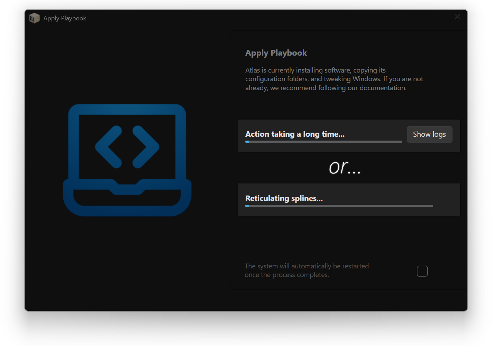

# :material-timer-lock: How do I fix 'Reticulating Splines' or 'Action taking a long time'?

When running the Playbook, some users might experience these messages:

- **'Reticulating splines'** - meaning there has been no status change in 5 minutes
- **'Action taking a long time'** - meaning there has been no status change in 15 minutes

Most of the time, this isn't an issue and is likely due to a slow internet connection or computer. However, it could be stuck if it has been on this screen for a long time. In that case, see the [scroll down to see solutions](#ensure-youre-on-a-clean-install-of-windows).

## :material-broom: Ensure you're on a clean install of Windows

Ensure that you're on a fresh install of fully updated Windows. We **highly** recommend following our [installation guide](../../getting-started/installation.md) for this. Installing Atlas on a non-fresh Windows installation is generally considered unsupported, and can cause the Playbook to get stuck.

## :material-checkbox-marked-outline: Fixes

### Restarting and re-applying the Playbook

You can restart Windows and attempt to re-apply the Playbook on a fresh startup. Again, ensure that Windows is updated, and try re-running the Playbook.

### Killing the responsible process

Click **Show logs** at the 'Action is taking a long time' status, open **Output.txt**, and scroll to the bottom to see what is stuck. If it's a PowerShell or Command Prompt action, you can kill those in the 'Details' section of Task Manager. Alternatively, if it's DISM, you would kill DISM instead.

However, please remember that these actions are responsible for specific functionality in Atlas, so interrupting them could cause an incomplete installation. Re-applying the Playbook is preferred if it works.

### Reporting the issue or asking for help

Consider asking for help on the [Discord server](https://discord.atlasos.net/) or [forums](https://forum.atlasos.net/), and if there's no solution there, consider opening a [GitHub Issue](https://github.com/atlas-os/atlas/issues) to help us fix your problem.

Make sure to include your `Output.txt` log.