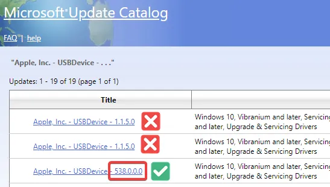

# :material-apple: Why is iTunes not recognizing my Apple device?

**If iTunes is not recognizing your Apple device, it's likely a driver issue. You can fix this by downloading and installing the Apple USB Drivers.**

If you're using Atlas and have not enabled [Automatic Driver Installation](../../getting-started/post-installation/atlas-folder/configuration.md#driver-updates), you will need to install the Apple USB driver manually.

## :material-package-down: Manual Installation

!!! tip
    If you're experiencing significant issues with drivers, consider enabling [Automatic Driver Installation](../../getting-started/post-installation/atlas-folder/configuration.md#driver-updates) from the Atlas folder.

1. Download the latest Apple USB drivers from the [Microsoft Update Catalog](https://www.catalog.update.microsoft.com/Search.aspx?q=Apple%2C%20Inc.%20-%20USBDevice) that begins with a three-digit version number.

    

2. Extract the downloaded zip file using 7-Zip or Explorer. Ignore any warnings that may appear.

3. Find the `.inf` file in the extracted folder. **Right-click** on the `.inf` file and select **Install**.
