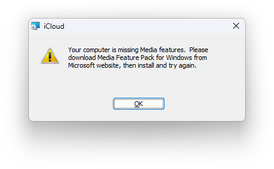

# :material-play-pause: How do I install the Media Feature Pack?

{ align=right width=350 }

**In Atlas v0.4.0, Windows Media Player (Legacy) is uninstalled by default, which causes this issue. It can be reinstalled reasonably easily.**

Alternatively, you might be on an N-edition of Windows. We recommend not using these as there's little benefit; Atlas already does the debloating. You can check in `winver.exe`.

!!! tip "v0.5.0 installs won't have this issue"

    In the next release, Atlas will not remove Windows Media Player (Legacy) for compatibility purposes.

## :material-checkbox-marked-outline: Reinstalling the Media Pack

1. Open **Settings**, and navigate from:
    
    [System -> Optional Features -> View/Add features](ms-settings:optionalfeatures){ .md-button }

1. Search for **'Windows Media'** and check **'Windows Media Player Legacy (App)'**
    - If you're on an N-edition of Windows, search for 'Media Feature Pack' instead

1. Click **Next** then **Add**

1. Wait for it to install

