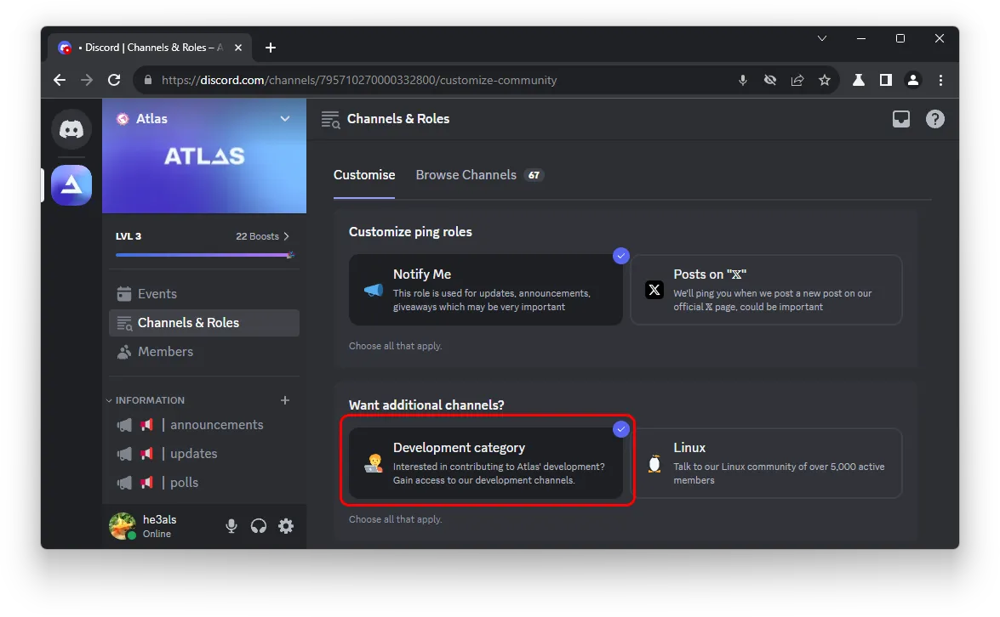

# :material-test-tube: How can I test pre-release builds of AtlasOS?

**If you wish to take part in testing nightly, pre-release development builds, you can do so by adding the 'Development' Discord role on our Discord server.**

We highly appreciate any contributions, and testing is [one of the many ways](../../contributions.md) that you can help build Atlas.

We often post announcements to the development Discord role when we need help testing new pre-release builds, as well as small polls and development updates. If you're interested, you can [join our Discord server](https://discord.atlasos.net/) and apply the development role to your profile.

