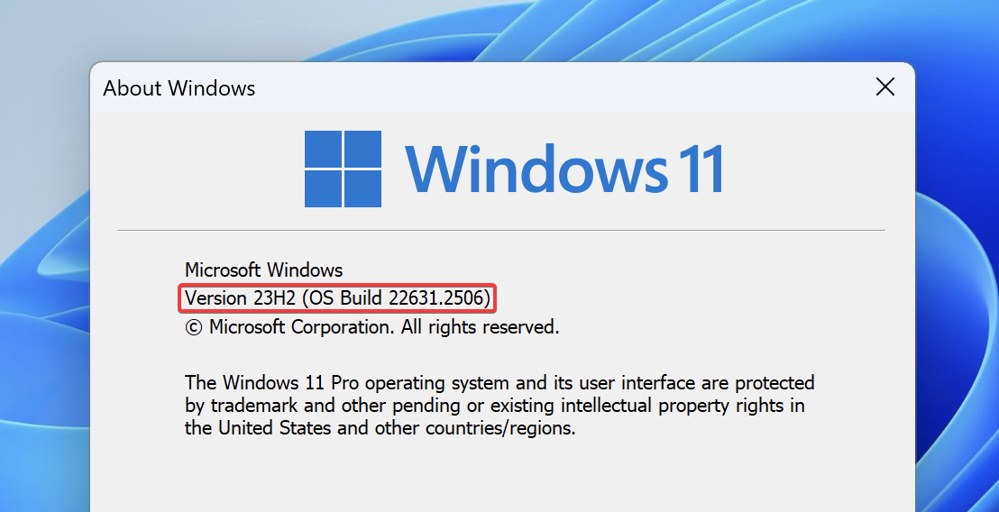

# :material-microsoft-windows-classic: Windows build not supported

**If your current build is not supported by AtlasOS, you may need to update.**

To see if your build matches the AtlasOS requirements, follow this guide:

## :material-wrench-cog-outline: Checking your version

1. Check your Windows version. You can do this by pressing ++win+r++ and typing `winver`.

2. Compare the build number in the window that popped up with the boxes below. If it matches, try to apply the playbook again. If it doesn't match, perform the steps below.

!!! note "Latest Windows versions"
    **:material-microsoft-windows: Windows 10:**
    Version 22H2 (OS Build 19045)
    
    **:material-microsoft: Windows 11:**
    Version 23H2 (OS Build 22631)

## :material-download: Updating Windows

=== ":material-microsoft-windows: Windows 10"
    Make sure all Windows updates have been completed, you should not have any Windows updates available after clicking the `Check for Updates` button in **Windows Update**. If there are any updates, install them and reboot. Then, [check your version](#checking-your-version).

    If this fails, the only way to fix it is to [reinstall Windows](../../getting-started/installation.md#reinstalling-windows) using an ISO downloaded from the [:material-cogs: Installation Guide](../../getting-started/installation.md#download-an-iso).
=== ":material-microsoft: Windows 11"

    For Windows 11, follow these instructions:

    1. Make sure all Windows updates have been completed, you should not have any Windows updates available after clicking the `Check for Updates` button in **Windows Update**. If there are any updates, install them and reboot. Then, [check your version](#checking-your-version).

    2. Download the offline update for Windows 11 23H2 [here](https://catalog.sf.dl.delivery.mp.microsoft.com/filestreamingservice/files/caa3ff4a-6420-4341-aeae-33b2d7f463be/public/windows11.0-kb5027397-x64_3a9c368e239bb928c32a790cf1663338d2cad472.msu).

    !!! info "For ARM64 Users"
        Your update is available [here](https://catalog.sf.dl.delivery.mp.microsoft.com/filestreamingservice/files/c29dd4ea-7f6a-4636-a991-29ba8ae70658/public/windows11.0-kb5027397-arm64_bacb74fba9077a5b7ae2f74a3ebb0b506f9708f3.msu).

    3. Open the downloaded file to install the offline update. When prompted, select `Yes` to install the update. This should take a few moments.

    4. Once the update is complete, restart your computer. You should now be Windows 11 23H2.
