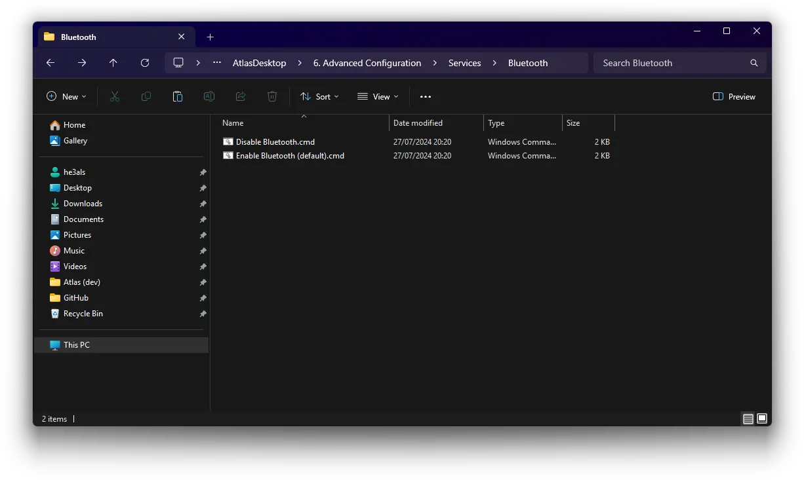

# :material-bluetooth: Does Bluetooth work on AtlasOS?

**Yes, Bluetooth is fully functional on AtlasOS.**

If you're using AtlasOS and have not enabled [Automatic Driver Installation](../../post-install/drivers/index.md#want-driver-installation-updates-through-windows-update-instead), you will need to install the Bluetooth driver manually. Follow these steps to set up Bluetooth:

1. If you've disabled Bluetooth, [enable Bluetooth services](../../post-install/atlas-folder/configuration.md#bluetooth) in the Atlas folder.

2. Install your Bluetooth driver. You can follow our [drivers guide](../../post-install/drivers/others.md) for this.
    - Most issues with Bluetooth are caused by installing improper drivers. Make sure to research and find the driver that is suited for your device.

3. Turn on Bluetooth and pair your device.

If these steps did not resolve your issue, try researching further into the driver you should download for your system. These are almost always the cause and are not an issue directly with AtlasOS.
