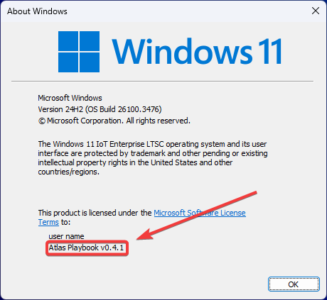
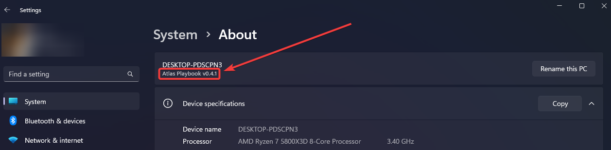

# :material-information-outline: Checking Your AtlasOS Version

Knowing which version of AtlasOS you have installed is important, especially when considering updates or troubleshooting. As mentioned in our [Updating AtlasOS guide](./updating-atlas.md), different versions have different update paths and support levels.

There are two primary ways to check your installed Windows version, which corresponds to your AtlasOS version:

## 1. Using the `winver` Command

This is a quick way to see your Windows build number and the Atlas Playbook version.

1.  Press ++win+r++ on your keyboard to open the Run dialog.
2.  Type `winver` and press Enter or click OK.
3.  A window will appear showing your Windows version and OS Build number. Below the user name, you should also see the **Atlas Playbook version** installed (e.g., `Atlas Playbook v0.4.1`).

<figure markdown="span">
  
  <figcaption>Atlas Playbook v0.4.1 shown in the winver dialog</figcaption>
</figure>

## 2. Using Windows Settings

You can also find detailed system information, including the Atlas Playbook version, in the Settings app.

1.  Open Windows Settings (you can press ++win+i++).
2.  Navigate to `System`.
3.  Click on `About`.
4.  Look directly under your PC's name (e.g., `DESKTOP-PDSCPN3`). You should see the **Atlas Playbook version** listed there (e.g., `Atlas Playbook v0.4.1`).
5.  Further down, under the "Windows specifications" section, you'll find the base Windows Edition (e.g., Windows 11 Pro) and the Version number (e.g., 22H2).

<figure markdown="span">
  
  <figcaption>Atlas Playbook v0.4.1 shown in the Windows Settings About page</figcaption>
</figure>

By checking the **Atlas Playbook version** using either of these methods, you can easily identify your installed release, helping you follow the correct [update procedures](./updating-atlas.md) or seek appropriate support. 