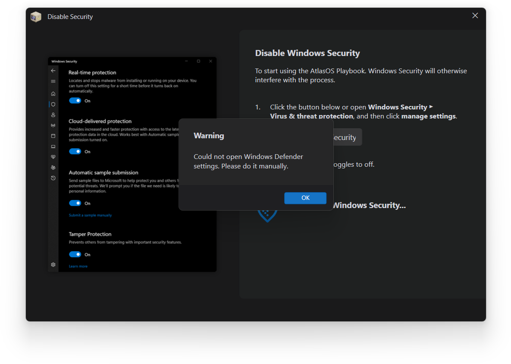

# :material-shield-search: How do I fix being unable to disable Defender to continue?

**You have likely not followed the installation documentation to reinstall Windows.**

Atlas requires you to follow the installation documentation to reinstall the latest version of Windows. We advise against using the **Reset this PC** feature within Windows, as this is not considered a complete Windows reinstall and would likely not solve this issue.

[Installing AtlasOS -->](../../../getting-started/index.md)

