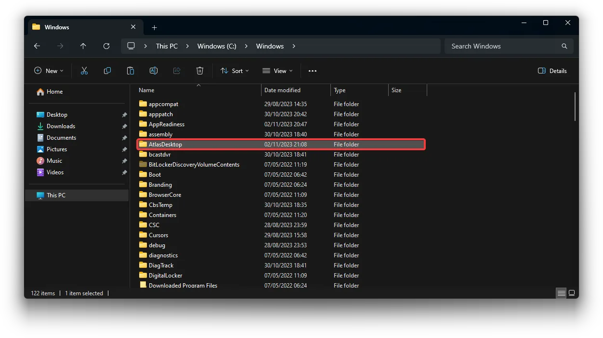

# :material-folder-question: How do I get the Atlas configuration folder back?

**If you deleted the Atlas configuration folder shortcut on your desktop, you can find it here: `C:\Windows\AtlasDesktop`.**

If you wish to have the folder on your desktop, you should right-click on the folder and create a shortcut.

## What about if I can't find AtlasDesktop?

You can download the **.zip** archive below, extract it, and place the `AtlasDesktop` folder in `C:\Windows`. The link below updates upon each new Atlas release.

[Download AtlasDesktop -->](https://download-directory.github.io/?url=https%3A%2F%2Fgithub.com%2FAtlas-OS%2FAtlas%2Ftree%2F
--8<-- "vars.md:atlasVer"
%2Fsrc%2Fplaybook%2FExecutables%2FAtlasDesktop)
