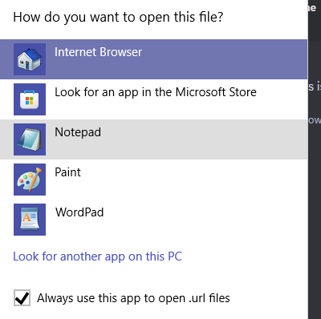

# :material-arrow-top-right-thick: How do I fix my shortcuts showing up as .url files or without an icon?

**Simply set the shortcut to open in "Internet Browser".**

=== ":material-microsoft-windows: Windows 10"

    1. Right click the shortcut and click `Choose another app` under `Open With...`

        

        !!! failure "If there is no `Open With...` menu, double click the shortcut instead."

    2. Choose **Internet Browser** and tick `Always use this app to open .url files`
    
        

    3. Press `OK`
=== ":material-microsoft: Windows 11"

    1. Right click the shortcut and click `Choose another app` under `Open With...`

        !!! failure "If there is no `Open With...` menu, double click the shortcut instead."

    2. Choose **Internet Browser** and click `Always`
