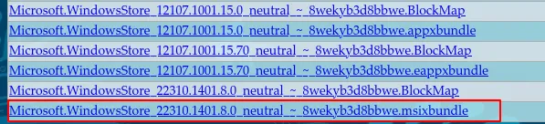

# :material-microsoft: Does AtlasOS support the Microsoft Store?

**Yes, the Microsoft Store works the same as on unmodified Windows.**

If you're experiencing issues with the Microsoft Store, these are unrelated to Atlas. However, we have some general fixes below which will restore its functionality.

## :material-store-check: Fixes

=== "Method 1 (Recommended)"

    ??? tip "Video demonstration"
        

            <video src="/assets/videos/wsreset.mp4" controls muted width="560" height="420"></video>
        

    1. Press ++win+r++ to open the **Run** dialog
    2. Type in `wsreset -i` and press ++enter++
    3. Try opening the Microsoft Store again. Once it's open, head to **Downloads and Updates** and wait for Microsoft Store to update

=== "Method 2"

    1. Go to [store.rg-adguard.net](https://store.rg-adguard.net)
    2. Change the drop-down on the left to **ProductID**
    3. Paste in `9WZDNCRFJBMP` and click the tick button
    4. Scroll down until you find the files starting with `Microsoft.WindowsStore`
    5. Click on the one that has the highest version number and ends in `.msixbundle`
       
    6. Double-click the downloaded file, and click **Install**
