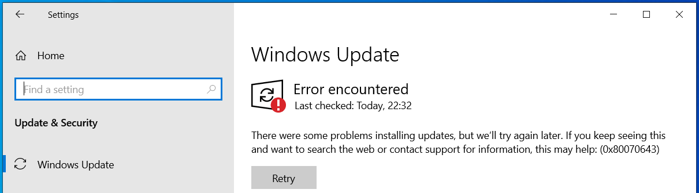

# :material-update: How do I fix errors with Windows Update on AtlasOS?

**Some users may have a Windows Update error when installing specific Windows updates. This page will guide you through fixing these errors.**

## :material-microsoft-windows: Windows 10 Error 0x80070643



This issue is on Microsoft's end with the update [KB5034441 for Windows 10](https://support.microsoft.com/en-gb/topic/kb5034441-windows-recovery-environment-update-for-windows-10-version-21h2-and-22h2-january-9-2024-62c04204-aaa5-4fee-a02a-2fdea17075a8). Try the fixes listed below in order, and retry updating on each fix:

1. **Ensure that you have adequate free storage**
    
    You should have at least 1GB of free storage on your Windows drive. If you have little free storage after reinstalling Windows, you likely haven't removed the backup of your previous Windows installation. See [Your old Windows installation](../getting-started/installation.md#your-old-windows-installation) for more information.

1. **Enable Windows Recovery**    
    1. Open **Command Prompt as Administrator**
    1. Type in `reagentc /enable` and press ++enter++
    1. Restart your computer

1. **Follow [Microsoft's guidance](https://support.microsoft.com/en-us/topic/kb5028997-instructions-to-manually-resize-your-partition-to-install-the-winre-update-400faa27-9343-461c-ada9-24c8229763bf)** (advanced)

1. **Hide the update**

    1. Download the [Show or hide updates](https://download.microsoft.com/download/f/2/2/f22d5fdb-59cd-4275-8c95-1be17bf70b21/wushowhide.diagcab) troubleshooter, and open it
    1. Click **Next**, then click **Hide updates**
    1. Check the update for **KB5034441**, click **Next**, then click **Close**

1. **Follow the [USB drive method](../getting-started/installation.md#3-material-microsoft-windows-reinstalling-windows) to install Atlas, and follow the steps to delete all partitions**

## :material-restore-alert: General errors

To fix some general Windows Update errors, try the following steps:

1. Open **Command Prompt as Administrator**, and enter the commands below in order:

    ```
    dism /online /cleanup-image /restorehealth
    sfc /scannow
    ```

    It is expected that the commands will take a while to complete. The first command will likely error with **'The source files could not be found,'** but you can safely ignore this.

1. Restart your computer

1. Attempt to update Windows again