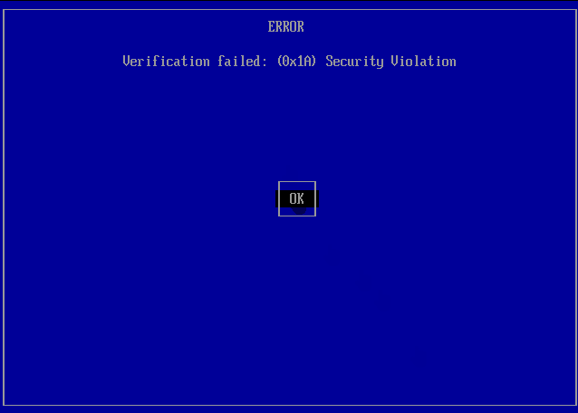

# :material-package-down: Installing AtlasOS

This guide will walk you through fully reinstalling Windows, installing Atlas on top of it, and completing other necessary steps. A full Windows reinstall is needed to ensure stability during the initial installation of Atlas.

Before continuing, we recommend reviewing our page to see [who Atlas is for](../../faq/install-faq/who-is-atlas-for.md).

<!-- --8<-- [start:style] -->

<!-- --8<-- [end:style] -->

## **0.** :material-clipboard-list-outline: Prerequisites

!!! danger "Atlas requires a full Windows reinstall to uninstall"
    As of the current versions of Atlas, if you ever need to uninstall it, you'll need to [reinstall Windows](../../faq/install-faq/reverting-atlas.md).

- Meeting the system requirements for [Windows 11](https://www.microsoft.com/windows/windows-11-specifications#table1)
    - We don't recommend bypassing Windows 11's requirements due to potential problems with updates and game anti-cheats
- 64-bit CPU ([you can check what you have](https://support.microsoft.com/en-us/windows/which-version-of-windows-operating-system-am-i-running-628bec99-476a-2c13-5296-9dd081cdd808))
    - If you have an ARM-based CPU, you can only use Atlas with Windows 11
- Knowledge of general Windows troubleshooting and usage

<!-- --8<-- [start:iso] -->
## :material-disc: **1.** Download an ISO
<!-- --8<-- [end:iso] -->

Before installing Atlas, you need a clean ISO to fully reinstall Windows.

<!-- --8<-- [start:iso1] -->
Choose your desired Windows version's ISO file, which will be used later in the guide.

The buttons below download an ISO directly from Microsoft's servers. They get the latest version of your desired Windows version for [Intel, AMD, and ARM CPUs](https://www.tenforums.com/tutorials/132836-check-what-processor-cpu-windows-pc.html#option1).

<noscript>
<b>The documentation's Windows ISO downloader doesn't show for you due to the documentation being loaded without JavaScript.</b>
See the alternatives below.
</noscript>

!!! question "Which version should I choose?"
    If you meet the official requirements, we **strongly** recommend choosing Windows 11. If not, use Windows 10.

!!! warning "Please download Windows 11 using the button below"
    Downloading Windows 11 from Microsoft's website will get you Windows 11 25H2, which is not yet supported by Atlas. 
    
??? grey-tip "Alternatives (Windows 10 Only)"

    !!! tip 
        Even though the downloader we use in our docs use Microsoft's servers, you can also download the ISO directly from Microsoft or use the Windows Media Creation Tool.
        
    

    === "Official Microsoft Sources"

        ### [Windows 10 :material-download:](https://www.microsoft.com/en-us/software-download/windows10ISO)

        - Click the link abvove and select **Windows 10 (multi-edition ISO)** and click **Confirm.**
        - Select your desired language and press confirm.
        - Click **64-bit Download** to begin your download.

    === "Windows Media Creation Tool"

        1. Download the [Windows 10 :material-download:](https://go.microsoft.com/fwlink/?LinkId=691209) Media Creation Tool, then open it
        1. Click the **Accept** button to agree to the Microsoft license terms
        1. Select **Create installation media (USB flash drive, DVD, or ISO file) for another PC**, click **Next**, and choose:
            - **Language:** Your desired language
            - **Edition:** Windows 10
            - **Architecture (Windows 10 only):** 64-bit (x64)
        1. Choose the **ISO file** option, then choose the download location
        1. After the ISO has completed downloading, click **Finish**

<!-- --8<-- [end:iso1] -->


<!-- --8<-- [start:drivers] -->
## :material-ethernet: **2.** Network Drivers

By default, Windows may not have your computer's network drivers, meaning after reinstalling, your computer could have no internet connection.

For this reason, we **strongly** recommend that you do one of the following:

- Download your network drivers beforehand and store them on external storage
- Have the ability to download and transfer network drivers from another device later

!!! question "Where do I get my network drivers?"
    !!! info inline ""
        

    You can find your computer's network drivers online by searching for your device or motherboard's official support page. 

    If you can't find it, try searching online for your network device's name in Device Manager instead. 
    
    If multiple of the latest network drivers are available, download them all.
    

    
<!-- --8<-- [end:drivers] -->

## :material-microsoft-windows: **3.** Reinstalling Windows

Before continuing, we **strongly** recommend you back up any valuable data to an external drive or [a cloud service](before-continuing.md).

=== ":material-microsoft: No USB Drive (recommended)"

    <!-- --8<-- [start:windowsOldNotice] -->
    **Only if you have enough free storage**, after finishing the Windows reinstall, `Windows.old` will be at the start of your Windows drive, containing your old data. You can retrieve data from the folder and delete it afterward, which this guide [covers later](#7-your-old-windows-installation).
    <!-- --8<-- [end:windowsOldNotice] -->

    This method only works if you're already on Windows.

    1. Disconnect any cables providing internet to your computer, such as an ethernet cable. Do not reconnect any until instructed to do so

    1. Right-click the previously downloaded ISO file and select **Open With** -> **File Explorer**

    1. Open **This PC** in File Explorer, and remember the ISO's drive letter (e.g. `H`) for the next step. The drive should look similar to { .twemoji } **CCCOMA_X64FRE_EN-GB_DV9**

    1. Press ++win+r++ to open the Run dialog

    1. Inside the Run dialog, type in the previously remembered drive letter, and then **without a space**, type `:\sources\setup.exe` after it. [**Example:** `H:\sources\setup.exe`](../../assets/images/win-setup-run-dialog.webp)

    1. Press ++enter++ on the Run dialog, and accept the User Account Control prompt
    - The message ["Make sure BitLocker Drive Encryption is suspended"](../../assets/images/bitlocker-error-setup.jpg) could appear from the Windows Setup when you press ++enter++. Refer to our [BitLocker decrypting instructions](../../faq/install-faq/decrypting-using-bitlocker.md) to resolve this, then retry from step 5 onwards

    1. Select **No thanks** when prompted for updates, then uncheck the box for **I want to help make the Windows installation better**

    1. If prompted, click **I don't have a product key**, as Windows should auto-activate later
        - If Windows doesn't auto-activate, you can enter a key later within Windows

    1. Choose your edition of Windows.
		<!-- --8<-- [end:reinstalling] -->
		<!-- --8<-- [start:atlasEditions] -->

		!!! note "Supported Editions"

			- Windows Pro
			- Windows Pro for Workstations
			- Windows Enterprise (excluding LTSC, IoT LTSC)

			**Windows Home is not supported.** If the Windows Setup did not give a choice of edition and it installs Windows Home anyway, you can always change Windows edition later by changing your Windows product key once Windows has finished installing, without having to reinstall anything.
		<!-- --8<-- [end:atlasEditions] -->

		!!! note "Windows 11 Requirement Error?"
			If you encounter an error stating your PC doesn't meet the requirements, you might need to enable TPM 2.0 in your BIOS/UEFI. See our guide: [:link: Enabling TPM 2.0](../../faq/general-faq/enabling-tpm.md)

		<!-- --8<-- [start:reinstalling1] -->

    1. Accept the license agreement and click **Custom: Install Windows only (advanced)**

    1. Select your Windows drive, click **Next**, click **OK** to the warning about `Windows.old`, and let the installation finish

=== ":material-usb-flash-drive: USB Drive"

    This method works on Linux and Windows.

    1. Download the latest release of [Ventoy :material-download:](https://github.com/ventoy/Ventoy/releases/) and extract it wherever you feel comfortable.        
        - Linux users can get it using a package manager

    1. Inside the Ventoy folder, run **Ventoy2Disk**

    1. In the opened window, select your USB drive and click **Install**
        - This will destroy all data on the USB drive!

    1. Copy your downloaded ISO file into the USB drive (labeled Ventoy)

    1. Disconnect any cables providing your computer internet, such as an ethernet cable
        - Do not reconnect to the internet until instructed to

    1. Restart your computer, boot into your BIOS' boot menu, then select the USB drive

        ??? failure "'Security Violation' Error"

            ??? tip "Video Demonstration"
                

                    <video src="/assets/videos/enroll-key-vtoy.mp4" controls muted></video>
                    
Credit to [Ventoy](https://ventoy.net/doc_secure.html) for the video demonstration.

                

            
            { align=right width=200 }

            If you get an error screen saying there was a 'Security Violation,' follow the steps below:

            1\. Press ++enter++ to load **MokManager**

            2\. Press any key to begin key management

            3\. Choose **Enroll Key From Disk**
                
            - The controls are arrow keys to move and ++enter++ to select

            4\. Choose `VTOYEFI`

            5\. Choose `ENROLL_THIS_KEY_IN_MOKMANAGER.cer`

            6\. Choose **Continue**, then **Yes**, and finally **Reboot**
            
            7\. Boot from the USB again, as the issue should be resolved

            ------

            If it is still not working, try 'Hash Enrollment,' as detailed in [Ventoy's guide](https://ventoy.net/doc_secure.html).

    1. Once booted into the Ventoy menu, select the Windows ISO using the arrow keys, press ++enter++, click **Boot in normal mode**, and press ++enter++ again

    1. **If you're installing Windows 11,** once booted into the Windows Setup, click 'Next' twice, then click 'Previous version of setup' in the bottom left corner of the window

    1. Select your preferred language preferences, click **Next**, then click **Install Now**

    1. If prompted, click **I don't have a product key**, as Windows will activate automatically later (as long as you have previously activated Windows legitimately)

    1. Choose your Windows edition
    <!-- --8<-- [end:reinstalling1] -->
--8<-- "installation.md:atlasEditions"

    !!! note "Windows 11 Requirement Error?"
        If installing Windows 11 and you encounter an error stating your PC doesn't meet the requirements, you might need to enable TPM 2.0 in your BIOS/UEFI. See our guide: [:link: Enabling TPM 2.0](../../faq/general-faq/enabling-tpm.md)

    <!-- --8<-- [start:reinstalling2] -->

    1. Accept the license agreement and click **Custom: Install Windows only (advanced)**

    1. At the 'Where do you want to install Windows?' screen, choose one of the following:

        === "Keeping data (recommended)"
            !!! note "Previous Windows data"
                <!-- --8<-- [end:reinstalling2] -->
                <!-- --8<-- "installation.md:windowsOldNotice" -->
                <!-- --8<-- [start:reinstalling3] -->
            - Identify the disk partition you want to install Windows to by looking at the total sizes, then select it
            - Click **Next**, then click **OK** to the warning about `Windows.old`

        === "Deleting data on one drive"
            !!! danger "This permanently deletes data!"
                Make sure to follow the instructions carefully to ensure you don't delete the wrong partitions.

            - Identify the drive number you want to install Windows to
                - You can identify your drives by their total sizes
            - One by one, carefully delete **your drive number's** disk partitions
            - Select the unallocated space of your drive number
            - Click **Next**

        === "Deleting data on all drives"
            !!! danger "This permanently deletes data on all drives!"

            - One by one, delete each disk partition in the window
            - Select the unallocated space of the drive you want to install Windows to
                - You can identify your drives by their total sizes
            - Click **Next**
    
    1. Wait for Windows to install
<!-- --8<-- [end:reinstalling3] -->

## :material-cog: **4.** Initial setup (OOBE)

You can either watch the video or use the 'Written Instructions' for this section.

=== "Video"

    

        <video src="/assets/videos/win11-OOBE.mp4" controls muted width="560" height="420"></video>
    

=== "Windows 10"
    ??? info "Written Instructions"
        Go through the setup, but make sure to:

        - Click **I don't have internet** when prompted to connect to the internet
        - Click **Continue with limited setup** or **Domain join** after the 'Internet' page
        - Deny each option in the **Privacy** section
        - Deny Cortana

    

        <video src="/assets/videos/win10-OOBE.mp4" controls muted width="560" height="420"></video>
    

## **5.** :material-screwdriver: Driver Updates

Drivers are essential software components that enable the OS to communicate with hardware devices. While Windows has fundamental drivers, some devices need external drivers to function correctly.
On Atlas, there are two options for external drivers:

| :material-update: Installation & Updates from Windows Update | :material-download: Manual Installation & Updates |
| --------------------------------------- | ------------------------------------ |
| :material-check-all: Easiest if you don't know how to get drivers | :material-check-all: Potentially less system resource usage |
| :material-check: Best compatibility, especially with OEM apps | :material-check-all: Less potentially unwanted applications |
| :material-check-all: Latest security & feature updates automatically | :material-check: Full control over your driver versions |
| :material-check: Almost never having to manually get drivers | :material-alert-circle-outline: You will likely need to get drivers for new devices |

**Choose the option you wish to install with and follow the instructions.**

If you don't know, choose 'Driver Installation & Updates from Windows Update.'

=== "Driver Installation & Updates from Windows Update"
    1. Connect your device to the internet

    1. Move on to the next section

=== "Manual Driver Installation"
    Don't connect to the internet yet, follow these steps:

    1. Open **Settings** -> **Windows Update**

    1. Temporarily **Pause Updates** for at least one week

    1. Connect your device to the internet
    
    1. Move on to the next section

## :material-wrench-cog-outline: **6.** Installing AtlasOS

??? danger "AME Wizard suddenly closing or being deleted?"
    Especially when a new version of AME Wizard is released, you might need to add AME Wizard as an exclusion or turn off **Real-time protection** in Windows Security. 

    To read more about this, view our [**AME Wizard Deleted**](../../faq/install-faq/ame-wizard-errors/ame-wizard-deleted.md) page.

1. Open Microsoft Edge, search [`atlasos.net`](https://atlasos.net)

1. On the website, click 'Get started', then click **-> Already following the guide?** at the bottom of the pop-up, and download the **Atlas Playbook** and **AME Wizard**

1. Extract both downloads to your desktop

1. If you have chosen [**Manual Driver Installation**](#5-driver-updates), run `Disable Drivers Installation in Windows Update.reg` from the extracted Atlas Playbook download and restart

1. Open **Settings** and update Windows, including optional updates, until no more updates are available. If paused, click **Resume Updates** to follow this step
    - If there's an error updating on Windows 10, see our page on [:material-update: Windows Update Errors](../../faq/general-faq/windows-update-errors.md) for a fix, retry updating, and continue with the rest of the installation guide

1. Open the **Microsoft Store** and update all apps
    - There might be a prompt to update the Microsoft Store first

1. Restart after all updates are complete. After restarting, check again for updates repeatedly until there are no more available updates

1. Open `AME Wizard Beta.exe` from the AME Wizard folder
    1. If there is a warning from SmartScreen that AME Wizard is an [unrecognized application](../../faq/install-faq/ame-wizard-errors/ame-wizard-deleted.md), bypass this warning by clicking **More info** and **Run anyway**
    1. Click on **Updates** at the top and make sure AME Wizard is up to date

1. Drag `Atlas Playbook.apbx` from the Atlas Playbook folder into AME Wizard

1. Follow the on-screen instructions from AME Wizard to install the Atlas Playbook

## :material-microsoft-windows-classic: **7.** Your old Windows installation
<!-- --8<-- [start:oldinstall] -->

If you previously followed steps that mentioned a `Windows.old` folder, you can find your previous Windows data at the start of your Windows drive in `Windows.old`. 

When you're sure that you've retrieved any valuable data from it, follow these steps:

1. Open **Windows Settings** -> **System** -> **Storage**
1. Click **Temporary files**, and wait for it to scan your files
1. Select **Previous version of Windows**, and then click **Remove files**
<!-- --8<-- [end:oldinstall] -->

-   #### Next: **[-> Setting up Atlas](setting-up.md)**

