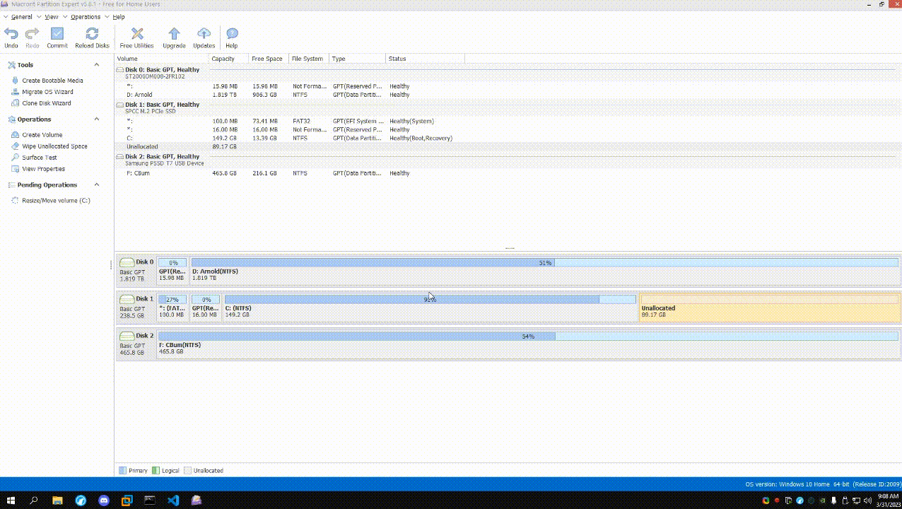

# No USB Installation Guide

_Originally posted by [Johnapolitan](https://github.com/Johnapolitan) in the Atlas repository, in [issues](https://github.com/Atlas-OS/Atlas/issues/153)._

!!! warning "Prerequisites"
	Before proceeding with this guide, make sure you have the latest 22H2 .iso file by following the [Downloading an ISO guide](https://docs.atlasos.net/getting-started/installation/#download-an-iso) on the installation page.

1. Download the [Macrorit Partition Expert](https://macrorit.com/download.html) and install it. (If prompted, choose 'Install Package')
2. Download [Install Windows Without USB by DanL](https://github.com/iidanL/InstallWindowsWithoutUSB) and extract it using 7-Zip or WinRAR

3. Run the Macrorit Partition Expert, and select the drive that you want to partition (in order to use both your current OS and Atlas, you need to have a drive big enough for both. To 'partition' is to split the drive into multiple partitions). In most cases, this is going to be the `C:` partition.
4. Right-click the selected partition, and click aresize/Move Volume'. In the menu that opens, allocate (to make space) as much space as you believe is necessary for Atlas. You do this by dragging the yellow slider. The unallocated section is how much space Atlas will have. I recommend having _atleast_ 20GB of storage.

5. Once your done, click OK. The menu should now close. Now a new section should appear next to your selected partition. It should be called 'Unallocated' and it needs to have more than 29 GB of available space. This is where Atlas will be installed. Right-click the unallocated space, and press 'Create Volume'. This should open another pop-up menu. Everything can be left as default, except you need to make sure the File System is set to 'NTFS'. _Also, make sure you remember the drive letter you set it to._ Once youare done, click OK.

6. Press the 'Commit' button in the upper-left-hand corner. Press 'OK' or 'Accept' to any prompts which appear. If it asks you to restart your PC, close any other applications and accept the prompt.
7. Once your PC has restarted, open the [Install Windows Without USB](https://github.com/iidanL/InstallWindowsWithoutUSB) folder you extracted earlier. It should prompt you to select a .iso, so select the .iso you installed (**Note: It may take a while for the file explorer window to pop-up. Please be patient**).
8.  Wait for the script to start. When prompted to enter the letter of the partition you want to install the iso on, **type the letter** of the partition we made earlier. For example: If you made the partition letter `E:` then type `E`.
9.   Wait for the script to finish running and display text saying you can restart your PC. At this point you may want to install [EasyBCD ](https://www.techspot.com/downloads/3112-easybcd.html)to add the drive as a boot option, because Windows will detect Atlas as a normal Windows install, so when you try to reboot, it's going to have you choose between your current OS (Windows Volume 1-10), and Atlas (Windows Volume 1-10). If you are confused by this statement though, do not install EasyBCD. Just reboot your PC, and select the non-default boot option.
10. Disconnect your ethernet/do not connect your Wi-Fi when going through Windows Setup.
11. Once the setup is complete, connect to the internet and download the [Wizard and Playbook](https://atlasos.net/downloads) from our site.
12. You can now continue with the [post installation](/getting-started/post-installation/).
