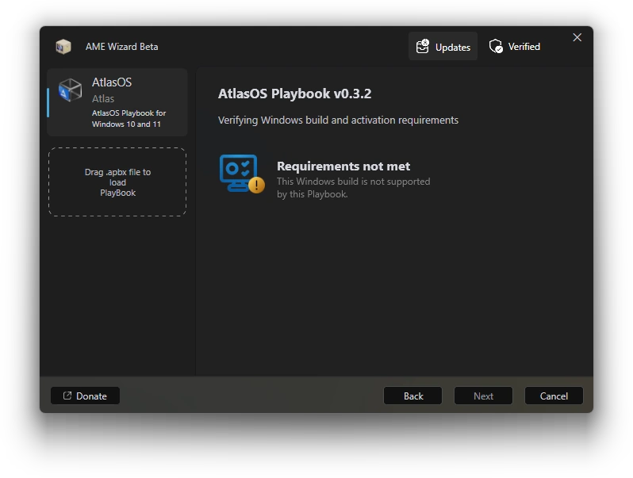

# :material-microsoft-windows-classic: How do I fix AME Wizard saying that this Windows build is not supported?

**You have likely not followed the Atlas installation guide to reinstall Windows.**

You'll see an error under **"Requirements not met"** saying that your Windows build isn't supported. To get to [a supported version](../windows-version-support.md), follow the installation guide.

[Installing AtlasOS -->](../../getting-started/installation.md)

